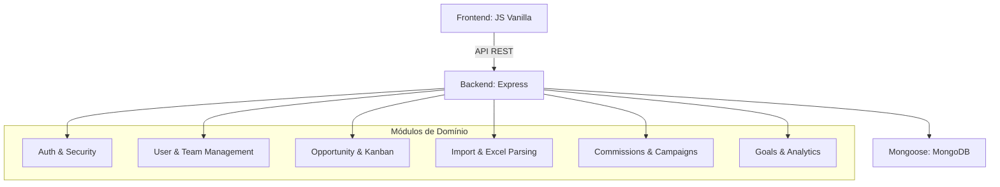

# STATE.md — CRM Funil de Vendas

## Visão Geral
Sistema Node.js com arquitetura modular híbrida. Backend Express + Frontend HTML/JS Vanilla, comunicando via REST API autenticada por JWT.

## Diagrama de Módulos

## Fluxo de Dados Principal (Importação à Venda)
1. **Importação:** Arquivo Excel enviado para `/api/import-profiles/upload`.
2. **Processamento:** Parser `XLSX` converte dados e valida contra Perfil de Mapeamento.
3. **Persistência:** Oportunidades criadas no MongoDB vinculadas a equipe/vendedor.
4. **Visualização:** Vendedor visualiza no Kanban (`/sales-kanban.html`).
5. **Ciclo de Vida:** Oportunidades mudam de fase até o fechamento.
6. **Auditoria:** Toda alteração de fase registrada (via `updated_at`), criador original (`created_by`) preservado.

## Decisões de Design (ADRs)

### AD-001: Soft Delete para Usuários
Em vez de remover usuários fisicamente, o sistema marca `ativo: false`. Preserva histórico de metas e auditoria de oportunidades.

### AD-002: Transferência Obrigatória
Ao inativar um usuário, oportunidades em aberto devem ser migradas obrigatoriamente para garantir que nenhum lead fique "abandonado".

### AD-003: Módulos Independentes
Funcionalidades complexas (Comissões, Contratos, etc.) residem em `src/modules` com rotas e modelos próprios.

### AD-004: Camada de UI Baseada em Phosphor
Uso de biblioteca de ícones leve e SVG para melhor desempenho no carregamento.

### AD-005: Visual KPI Cards (2026-08-07)
Cards de métricas (`.kpi-card`) envolvidos em wrapper `.glass-panel` unificado. Fundo individual trocado de `var(--surface-dark)` para `rgba(255, 255, 255, 0.03)` — sem dupla camada visual.

### AD-006: Layout Flex para KPI Cards (2026-08-08)
Grid CSS (`repeat(3, 1fr)`) substituído por Flexbox com `width: fit-content`. Cards se ajustam ao comprimento do texto, eliminando largura fixa. Toggle do container alterado de `"grid"` para `"flex"`.

### AD-007: Parse de Data Local e Filtros Reativos do FilterBar (2026-08-09)
Especificação para saneamento de datas com parsing local (`new Date(year, month - 1, day)` - AD-011), população de equipes via `/api/teams`, busca flexível por supervisor/coordenador com `$or` e filtragem automática reativa ao alterar seletores do `#filterBar`.

### AD-012: Interface de Manual do Usuário Standalone e Adaptativa (2026-08-10)
Navegação de documentação através de `public/manual-usuario.html` alimentada pelo módulo estático `public/modules/manual-usuario/manual-data.js`. Filtragem reativa por perfil (`vendedor`, `supervisor`, `coordenador`, `suporte`, `admin`) utilizando dados de sessão (`getUser()`) com busca instantânea em tempo real e atalhos na Sidebar e Header do CRM.

## Dependências Externas
- **MongoDB Atlas/Local:** Persistência de dados.
- **Node.js:** Runtime do servidor.
- **Docker:** Orquestração de containers e ambiente de produção Ubuntu.
- **NGINX:** Servidor reverso para balanceamento e segurança em produção.

## Manual do Usuário (Resumo)

### Primeiros Passos
1. **Acesso:** URL do sistema no navegador (ex: `http://localhost:3000`).
2. **Login:** E-mail e senha cadastrados.
3. **Navegação:** Barra lateral para Dashboard, Funil de Vendas, Organograma.

### Funcionalidades Principais
- **Gestão de Oportunidades (Kanban):** Visualização por colunas, arraste para atualizar status, edite detalhes.
- **Importação de Leads:** Upload de XLSX/CSV com perfis de mapeamento reutilizáveis.
- **Gestão de Equipe (Organograma):** Visão hierárquica por cargos, filtros, Kanban de performance.
- **Inativação e Transferência (Admin):** Soft delete com transferência obrigatória de oportunidades.

### FAQ
- Dados de vendedor inativado são preservados; oportunidades são transferidas.
- Planilha importada precisa de mapeamento de colunas configurado.
## Changelog

### [5.43.0] - 2026-08-14

#### Adicionado / Corrigido

- **Monitoramento de Instâncias do Robô (fleet monitoring)**:
  - `src/modules/robot-docusign/routes/robotInstanceRoutes.js`: Adicionada rota `GET /instances` para listar instâncias ativas do robô (fleet monitoring).
  - `src/modules/robot-docusign/routes/robotInstanceRoutes.js`: Adicionado middleware `authorize("admin")` nas rotas de instância para restringir acesso a administradores.
  - `src/modules/robot-docusign/index.js`: Eliminada colisão de mount genérico `instanceRoutes` — rotas de instância agora usam paths explícitos (`/instance/*` e `/instances`).
  - `src/modules/robot-docusign/routes/robotInstanceRoutes.js`: Suporte a rotas diretas (`/instances`, `/instance/:id/heartbeat`, `/instance/:id/pdfs/:filename`) além das rotas com prefixo `/api/robot-docusign`.

#### Alterado

- **Build Multi-Robot e Makefile**:
  - `Makefile`: Alvos `test-headed-ps` e `fetch-robot-debug-images` atualizados para suportar múltiplos robôs e PowerShell no Windows.
  - `build/build.js`: Atualizado para suportar build multi-robot com opções headless e executáveis standalone.

- **Documentação e Specs**:
  - Documentação de build multi-robot e opções headless atualizada.
  - Specs duplicadas do `gestor-oportunidades` removidas deste repositório.

### [5.36.0] - 2026-08-14

#### Corrigido

- **Implementação dos Métodos start() e stop() no robotScheduler**:
  - `src/modules/robot-docusign/services/robotScheduler.js`: Adicionadas as funções exportadas `start(intervalMs)` e `stop()` para inicialização e controle do loop periódico de agendamento de jobs do robô DocuSign, corrigindo o erro `TypeError: robotScheduler.start is not a function` na inicialização do servidor em `src/server.js`.

### [5.35.0] - 2026-08-13

#### Adicionado

- **Target no Makefile para Download de Screenshots de Debug (`make fetch-robot-debug-images`)**:
  - `Makefile`: Adicionado o alvo `fetch-robot-debug-images` que extrai screenshots gerados pelo robô no container Docker (`app_gestor:/app/tmp/robot-debug`) no servidor de produção via SSH/SCP para a pasta local `tmp/robot-debug/`.

### [5.34.0] - 2026-08-12

#### Corrigido

- **Alinhamento de Seletores de Login e Validação de Sessão no Robot-DocuSigner**:
  - `src/modules/robot-docusign/services/robotSession.js`: Adicionado suporte aos seletores `email_input`, `password_input` e `login_button` (definidos em `robotSelectors.js`), captura automática de screenshot para auditoria em `tmp/robot-debug/` em caso de erro no login e validação final da URL para evitar capturar cookies de páginas presas em `/oauth/`.
  - `src/modules/robot-docusign/services/robotSession.test.js`: Adicionados testes unitários para a resolução de seletores do robotSelectors e para a captura de screenshot de debug em falha de navegação OAuth.

### [5.33.0] - 2026-08-12

#### Adicionado

- **Suite de Testes de Regressão das Correções AD do Robô DocuSign**:
  - `src/modules/robot-docusign/services/robotSession.test.js`: Adicionado bloco `describe("regression: error propagation")` para validar lançamento/propagação de erros em falhas de `waitForSelector`, `fill`, `click` e no encadeamento de passos.
  - `src/modules/robot-docusign/services/robotBrowser.test.js`: Criada suíte de testes cobrindo navegação autenticada em `ensureAuthenticated`, redirecionamento e re-login, descarte/invalidação de sessão inválida e validação de credenciais configuradas no `send`.

### [5.32.0] - 2026-08-12

#### Corrigido

- **Detecção Automática de Redirecionamento e Reautenticação de Login no Playwright (Robô DocuSign)**:
  - `src/modules/robot-docusign/services/robotBrowser.js`: Adicionada função `ensureAuthenticated` para detectar se o Playwright foi redirecionado para a tela de login OAuth (`account.docusign.com`), acionando o login automático e renovação de sessão antes de interagir com o formulário de envio.
  - `src/modules/robot-docusign/services/robotSession.js`: Refatorada `loginAndSaveSession` com aguardo resiliente por seletores de e-mail e senha (`waitForSelector`) para evitar timeouts de formulário.
  - `src/modules/robot-docusign/services/robotOrchestrator.js`: Repassadas as credenciais salvas em `SystemConfig` (`config.credentials`) nas opções do `executeRobotAction`.

### [5.31.0] - 2026-08-12

#### Corrigido

- **Autenticação SSE (401) e Busca Flexível no Polling Fallback (404) do Robô DocuSign**:
  - `public/modules/contratos/services/docusignService.js`: Adicionado token JWT na URL da conexão `EventSource` (`/api/robot-docusign/jobs/${jobId}/stream?token=...`), corrigindo a rejeição 401 Unauthorized do `authMiddleware`.
  - `src/modules/robot-docusign/controllers/robotDocusignController.js`: Atualizada a consulta no `getJobStatus` para pesquisar por `_id` ou por `contract_id`/`contractId` (`$or`), resolvendo o erro 404 Not Found quando a consulta no polling fallback é realizada passando o ID do contrato.

### [5.30.0] - 2026-08-12

#### Adicionado / Alterado

- **Consumo de SSE com Polling Fallback no Frontend & Configuração Nginx**:
  - `public/modules/contratos/api.js`: atualizado método `triggerRobot` para aceitar HTTP 202 Accepted (`if (!response.ok && response.status !== 202)`). Adicionado método `getRobotJobStatus(jobId)` consultando `GET /api/robot-docusign/status/${jobId}`.
  - `public/modules/contratos/services/docusignService.js`: implementado `handleRobotJobStream(jobId, btn)` conectando ao stream SSE em `/api/robot-docusign/jobs/${jobId}/stream`, atualizando o progresso na UI, tratando status `completed`/`failed` e ativando Polling Fallback a cada 3s via `window.api.getRobotJobStatus(jobId)` em caso de `onerror`.
  - `nginx/default.conf`: adicionada rota de streaming `location ~ /api/robot-docusign/jobs/.*/stream` desabilitando buffering/cache e definindo timeout de 3600s antes de `location /api`.

### [5.29.0] - 2026-08-12

#### Corrigido

- **Envio via Robô Playwright DocuSign (`robotModeRobot`)**:
  - Corrigida a desestruturação e validação de `config.enabled` e `config.mode` em `public/modules/contratos/services/docusignService.js`, permitindo o envio autônomo via robô sem cair no fallback para a API oficial de dev.
  - Alinhados os valores do modo (`robot` e `api`) em `public/modules/config-sistema/robot-docusign/robot-docusign.js` para evitar divergência de valor padrão no formulário.
  - Atualizada a extração do signatário em `src/modules/robot-docusign/services/robotOrchestrator.js` para obter nome, e-mail e CPF a partir de `contract.client.representante`.
  - Criada especificação e tasks em `.specs/features/robot-docusigner/sub-specs/job-async-sse/` para migração da rota de disparo para o padrão assíncrono (HTTP 202 Accepted) com streaming de progresso em tempo real via Server-Sent Events (SSE) e Polling Fallback, eliminando o erro 504 Gateway Time-out.

### [5.28.0] - 2026-08-12

#### Corrigido

- **Descriptografia da Senha do Robô DocuSign no Backend (`docusignPassword`)**:
  - Atualizado `getRobotDocusignConfig` em `src/modules/config-sistema/controllers/systemConfigController.js` para aplicar `decryptText` no campo de senha da configuração do robô DocuSign antes de enviar a resposta ao frontend.
  - Corrigido o bug onde a senha em formato hash criptografado (`enc:...`) de 80+ caracteres fazia o campo `<input type="password" id="docusignPassword">` ser preenchido por uma longa linha de asteriscos ao recarregar a página.
  - Adicionado teste unitário cobrindo a descriptografia da senha em `src/modules/config-sistema/controllers/systemConfigRobotDocusign.test.js`.

### [5.27.0] - 2026-08-12

#### Corrigido

- **Preenchimento de Campos na Retomada de Contrato (Step 6)**:
  - Adicionada a propriedade `orgao: String` no sub-schema `client.socios` em `Contract.js`.
  - Atualizado `contractFormCollector.js` e `contractMediator.js` para coletar e salvar os dados de `recebedor` (`nome`, `rg`, `orgao`, `cpf`, `telefone`), `socioOrgao` e `tokenInfo` (`tokenLogin`, `nomeTbp`, `cnpjTbp`).
  - Atualizado `contractResumeService.js` para preencher `cli-capital`, `socio-orgao`, `recebedor` (com fallback para o administrador em contratos legados) e `tokenInfo` (com fallback para resolução por UF/DDD).

### [5.26.0] - 2026-08-12

#### Corrigido

- **Resiliência na Exclusão de Contratos (bugfix-contract-deletion)**:
  - Atualizado `storageService.js` (`resolvePath`, `exists` e `deleteFile`) para permitir caminhos em `tmp/` além de `uploads/`, tratando exceções de I/O com `try/catch` e logs de aviso.
  - Atualizado `contractService.js` (`deleteContract`) envelopando a deleção de documentos e anexos do DocusignEnvelope em blocos `try/catch` para garantir que a exclusão dos registros no banco de dados (`Contract` e `DocusignEnvelope`) ocorra sem erros HTTP 500.

### [5.25.0] - 2026-08-11

#### Adicionado

- **Frontend Config do Robô DocuSign (T08-frontend-config)**:
  - `public/modules/config-sistema/config-sistema.html`: Card de atalho "Robot DocuSign" na central de configurações (`
`), preservando 100% dos 3 cards legados (*Horários de funcionamento*, *Exibir / Ocultar Elementos* e *Gestor de Tokens*).
  - `public/modules/config-sistema/robot-docusign/robot-docusign.html` e `robot-docusign.css`: Interface dedicada com seções de Toggle & Modo, Credenciais, Agendamento & Expediente, Limites & Performance e Métricas em Tempo Real em padrão Glassmorphism responsivo.
  - `public/modules/config-sistema/robot-docusign/robot-docusign.js`: Controle de acesso ACL (`admin`), Auto-Save via `PUT /api/system-config/robot-docusign`, Teste de Login via `POST /api/robot-docusign/test-login` e documentação JSDoc.

### [5.24.0] - 2026-08-11

#### Adicionado

- **Agendamento e Cron Trigger do Robô DocuSign (T09-agendamento)**:
  - Adicionado `src/modules/robot-docusign/services/robotScheduler.js` com a função `processPendingJobs()` para verificação de robô ativo (`enabled: true`), expediente permitido (`isTimeAccessAllowed`) e limite de concorrência (`max_concurrent`).
  - Adicionado handler `processPending(req, res)` em `src/modules/robot-docusign/controllers/robotDocusignController.js`.
  - Adicionada rota `POST /api/robot-docusign/process-pending` em `src/modules/robot-docusign/routes.js`.
  - Exportado `scheduler` no barrel export em `src/modules/robot-docusign/index.js`.
  - Criada suíte de testes unitários `src/modules/robot-docusign/services/robotScheduler.test.js` e adicionados testes de integração supertest para `POST /process-pending` com 100% de sucesso.

### [5.23.0] - 2026-08-11

#### Adicionado

- **Frontend Config Robot DocuSign (T08)**:
  - Adicionado 4º card de atalho na Central de Configurações (`config-sistema.html:69-78`) com link para a página dedicada, mantendo os 3 cards legados intactos.
  - Criada página dedicada `robot-docusign.html` com seções: Toggle & Modo, Credenciais, Agendamento & Expediente, Limites & Performance, Métricas em Tempo Real.
  - Criado `robot-docusign.css` com padrão Glassmorphism responsivo (411 linhas).
  - Implementado `robot-docusign.js` com: controle de acesso admin, auto-save via `PUT /api/system-config/robot-docusign`, teste de conexão via `POST /api/robot-docusign/test-login`, e funções JSDoc documentadas.

### [5.22.0] - 2026-08-11

#### Adicionado

- **Indicador de Modo no Step 6 — Robot/API (T07-frontend-step6)**:
  - Adicionado container `#robot-mode-badge` na área de ação do Step 6 (`contratos.html`) com badges visuais 🤖 Robot (`.badge-robot`) e 📡 API (`.badge-api`).
  - Adicionados métodos `getRobotConfig()` e `triggerRobot()` em `public/modules/contratos/api.js` para comunicação com o orquestrador (`/api/robot-docusign/config` e `/api/robot-docusign/trigger`).
  - Criada função `checkRobotConfig()` em `docusignService.js` que alterna dinamicamente a visibilidade do badge conforme configuração do robô.
  - Atualizada `simulateDocuSignSend()` para direcionar envio via orquestrador quando `enabled: true` e `mode: 'robot'`, exibindo indicador visual e toast informativo.
  - Importada e invocada `checkRobotConfig()` no `DOMContentLoaded` de `contratos.js`.

### [5.21.0] - 2026-08-11

#### Adicionado

- **Controller e Rotas do Robô DocuSign (T06-controller)**:
  - Adicionado `src/modules/robot-docusign/controllers/robotDocusignController.js` com validação Zod e suporte aos endpoints `trigger`, `status`, `jobs`, `metrics`, `logs`, `config`, `test-login` e `queue`.
  - Adicionado `src/modules/robot-docusign/routes.js` aplicando os middlewares `protect` e `authorize("admin")`.
  - Adicionado barrel export `src/modules/robot-docusign/index.js` e montagem em `/api/robot-docusign` em `src/app.js`.

### [5.20.0] - 2026-08-11

#### Corrigido

- **Suite E2E — Regressão contra produção (10/10 passing)**:
  - `contratos.spec.js`: Corrigido `waitForResponse` que capturava endpoint errado (`/api/contracts/docusign/send/` → `/api/docusign/send/`) e conflitava com `/api/contracts/generate-pdf-html`. Simplificado `beforeEach` removendo login redundante (storageState já autentica).
  - `navbar.spec.js`: Adicionado `networkidle` no `beforeEach` para aguardar sidebar async, dismiss automático de `#accessViolationsModal`, uso de `.drawer-close-btn` para fechar sidebar (toggle fica obstruído), e `page.evaluate` para dispatch click real no backdrop.
  - `upload-inspect.spec.js`: Removido campo `docusign` (não existe no schema Mongoose). AccessHash agora é gerado via `GET /api/client-docs/link/:contractId`. Upload corrigido para `/api/docusign/portal/:hash/upload`. Assertions ajustadas para `clientDocs` flat.
  - `playwright.config.js`: Adicionado `storageState` para reutilizar `auth-state.json` entre testes.

### [5.19.0] - 2026-08-11

#### Adicionado

- **Serviço Core de Automação de Navegador do Robô DocuSign (T04-browser)**:
  - Adicionado `src/modules/robot-docusign/selectors/docusign-ui.json` com seletores de interface para login, dashboard, send, download, resend e reports.
  - Adicionado `src/modules/robot-docusign/services/robotSelectors.js` para carregamento e resolução dinâmica de seletores com fallback hardcoded.
  - Implementado `src/modules/robot-docusign/services/robotBrowser.js` contendo as operações Playwright (`send`, `status`, `download`, `resend`, `reports`) e retry automático em falhas transitórias (`withRetry`).

### [5.18.0] - 2026-08-11

#### Adicionado

- **Model RobotJob para Fila de Jobs do Robô DocuSign**:
  - Novo modelo Mongoose em `src/modules/robot-docusign/models/RobotJob.js` com suporte completo aos requisitos de REQ-001 (SPEC.md) e T01-modelo.md.
  - Campos de rastreio de execução: `steps` (array de submódulos com name, status, timestamp, duration, error), `envelopeId`, `signedDocPath`, `startedAt`, `completedAt`.
  - Suporte a enums de modo: `mode` (robot/api) e `robot_mode` (boolean).
  - Compatibilidade de aliases via hook pre-save: `contract_id` ↔ `contractId`, `attempts` ↔ `retryCount`, `error` ↔ `lastError`.
  - Índices de banco de dados: simples (`status`, `contract_id`, `next_retry_at`) e compostos (`{ contractId: 1, status: 1 }`, `{ createdAt: -1 }`).
  - Testes unitários completos em `src/modules/robot-docusign/models/RobotJob.test.js` com 6 cenários de validação.

### [5.17.0] - 2026-08-11

#### Adicionado

- **Campos de Datas VTME na Importação**:
  - Novos campos `data_insercao_vtme` e `data_ativacao_vtme` no schema do modelo Opportunity (`src/models/Opportunity.js`).
  - Campos adicionados à lista de permitidos para atualização via importação (`src/modules/import-opportunities/services/update-opportunity-fields.js`).
  - Campos disponíveis para mapeamento na UI de importação (`public/modules/import-profile/constants.js`).
  - Sinônimos para mapeamento automático adicionados ao auto-mapper (`public/modules/import-profile/auto-mapper.js`).
  - Especificação completa em `.specs/features/opportunity-import/spec-vtme-dates.md`.

### [5.16.0] - 2026-08-11

#### Adicionado

- **Especificação de Tooltips Padronizadas**:
  - Nova spec em `.specs/features/globais-ui/tooltips/spec.md` definindo um único padrão CSS puro (hover-only, sem JS) para todas as tooltips da aplicação.
  - Padroniza as 4 implementações existentes: CSS custom (`style.css`), CSS popover (`commissions`), Bootstrap tooltip (`acl`), `title` nativo (`dashboard`).
  - Define estrutura HTML, classes CSS, variáveis, posicionamento e regras de depreciação.

### [5.15.0] - 2026-08-10

#### Adicionado

- **Manual do Usuário Standalone e Adaptativo**:
  - Nova interface de documentação em `public/manual-usuario.html` com navegação por categorias, campo de busca em tempo real e visualização de passos.
  - Módulo de dados de documentação em `public/modules/manual-usuario/manual-data.js` cobrindo todas as telas e permissões por papel.
  - Controlador de exibição por cargo (`public/modules/manual-usuario/manual-app.js`) com seletores dinâmicos de perfil.
  - Pontos de acesso adicionados na Sidebar e Header do CRM.

### [5.14.0] - 2026-08-10

#### Alterado

- **Ajustes de UI nos Modais de Importação de Oportunidades**:
  - Removido botão `btnStep2Save` do Step 2 do modal de perfil em `public/import-profiles.html` e limpas suas referências em `public/modules/import-profile/ui.js`.
  - Adicionados IDs semânticos únicos em padrão `camelCase` em todos os elementos de `profileModal` e `executeModal`.
  - Removidos IDs órfãos `profileStep3TeamOptions` e `profileStep3TeamGroup` (não referenciados em JS/CSS).

### [5.14.2] - 2026-08-12

#### Adicionado / Corrigido

- **Módulo Robot DocuSign**:
  - Implementado utilitário `decryptText` em `systemConfigController.js` (decifrando strings `enc:iv:data` cifradas via AES-256-CBC) e aplicado em `getRobotConfig()` no `robotOrchestrator.js`.
  - Atualizados os handlers de atualização de configuração em `systemConfigController.js` e `robotDocusignController.js` para aplicar `encryptText` na senha antes de salvar, evitando dupla cifra.
  - Criado o controller e rota `POST /api/robot-docusign/trigger-batch` (com validação Zod `{ contractIds: z.array(z.string()).min(1) }`) para disparo sequencial de jobs em lote para administradores.
  - Atualizado o agendamento (`robotScheduler.processPendingJobs`): quando a fila do robô não possui jobs pendentes, busca automaticamente o `Contract` mais antigo com `status: "gerado"` e dispara o job de envio (`"send"`).
  - Atualizado o `robotOrchestrator`: no sucesso da ação `"send"`, atualiza `Contract.status = "enviado"`; no sucesso da ação `"download"`, atualiza `Contract.status = "assinado"`, armazena o arquivo em `uploads/{cnpj}_{razao}/contrato_assinado_{envelopeId}.pdf` e registra o caminho relativo em `job.signedDocPath`.

### [5.14.1] - 2026-08-11

#### Corrigido

- **Módulo Robot DocuSign**:
  - Suporte à variável `PLAYWRIGHT_CHROMIUM_EXECUTABLE_PATH` e argumentos `--no-sandbox` ao lançar o Chromium em `src/modules/robot-docusign/controllers/robotDocusignController.js` e `src/modules/robot-docusign/services/robotOrchestrator.js`, utilizando o Chromium pré-instalado no Docker Alpine.
  - Removido botão de salvamento manual `btnSaveConfig` e handler do evento `submit` em `public/modules/config-sistema/robot-docusign/`, padronizando o salvamento exclusivamente via auto-save.
  - Normalizados os valores das `<option>` do `<select id="scheduleInterval">` para inteiros puros (`"5"`, `"10"`, `"15"`, `"30"`), alinhando `loadConfig()` / `saveConfig()` e prevenindo recarregamento da página via `onsubmit="return false;"` e `e.preventDefault()`.

### [5.37.0] - 2026-08-11

#### Adicionado

- **Teste de regressão do módulo robotDocusign**: Criado suite de testes de integração com `supertest` cobrindo os 9 endpoints do controller (`trigger`, `status`, `jobs`, `metrics`, `logs`, `config`, `test-login`, `queue`). 31 cenários validando autenticação, autorização, validação, sucesso e tratamento de erros. Arquivo: `src/modules/robot-docusign/controllers/robotDocusignController.test.js`.

### [5.38.0] - 2026-08-13

#### Adicionado

- **Robô RPA DocuSign Multi-Instância e Executável Standalone Protegido**:
  - **Concorrência Atômica**: Extensão do modelo `RobotJob` com campos `locked_by`, `lock_expires_at` e `instance_metadata`, permitindo processamento concorrente seguro em até 3 robôs paralelos sem duplicidade.
  - **Monitoramento de Instâncias**: Novo modelo `RobotInstance` e endpoints `/api/robot-docusign/instance/*` com autenticação JWT de 30 dias, heartbeat e download temporário de PDFs.
  - **Projeto Standalone**: Módulo `robot-standalone/` com arquitetura baseada em `ApiClient`, `Scheduler` (polling resiliente) e `JobRunner` (Playwright com destruição garantida de PDFs em `finally`).
  - **Pipeline de Build Protegido**: Script `build/build.js` integrando `esbuild` (CJS bundling), `javascript-obfuscator` (ofuscação de fluxo e strings), `bytenode` (compilação para bytecode V8 nativo `.jsc`) e `@yao-pkg/pkg` (geração do `.exe` standalone para Windows).

### [5.13.0] - 2026-08-07

#### Alterado

- **Refatoração de Cálculo de KPIs do Frontend para Backend**:
  - Centralização de todas as 9 métricas do Dashboard e gráfico sparkline no endpoint backend `GET /api/kpis` (`src/modules/kpis/`).
  - Frontend transformado em componente puro de visualização (`public/js/features/dashboard/components/kpi-cards.js`).
  - Exclusão do arquivo legado `update-kpis.js`.

### [5.39.0] - 2026-08-12

#### Corrigido

- **Tratamento de Autenticação e Prevenção de Timeouts no Robô DocuSign (`robot-docusign`)**:
  - Remoção de `.catch(() => {})` silenciosos na rotina de login (`loginAndSaveSession` em `src/modules/robot-docusign/services/robotSession.js`), permitindo a propagação de exceções reais do Playwright.
  - Inclusão de re-verificação da URL pós-login em `ensureAuthenticated` (`src/modules/robot-docusign/services/robotBrowser.js`), invalidando sessões corrompidas no MongoDB via `invalidateSession()` e lançando falha rápida (*fail fast*).
  - Adicionado guard de verificação de URL antes do preenchimento de campos em `send()`, evitando timeouts genéricos de 30s.

### [5.12.1] - 2026-08-07

#### Alterado

- **Visual KPI Cards no Dashboard**: cards de métricas (`.kpi-card`) agora vivem dentro de um wrapper `.glass-panel` unificado, eliminando fundo opaco individual (`var(--surface-dark)`) em favor de `rgba(255, 255, 255, 0.03)` — sem dupla camada visual. Arquivos: `public/dashboard.html`, `public/css/dashboard.css`.

### [5.12.0] - 2026-07-21

#### Adicionado

- **Controle de Acessos dinâmico (ACL & RBAC)**: Coleção de permissões `role_permissions` em banco isolado (`crm_acl`) e tela de matriz administrativa interativa em `public/modules/acl/controle-acessos.html` para cargo `admin`.
- **6ª Etapa no Stepper de Contratos**: Integração do Dashboard centralizado de envelopes DocuSign diretamente em `contratos.html` como Step 6 (Gestão e Anexos), removendo o link antigo da sidebar.

#### Corrigido

- **Sincronização de Permissões no Startup**: Correção do problema em que novos campos de permissão adicionados no código (como `contracts:view` na etapa 6) resultavam em erros 403 Forbidden para bases já migradas de `vendedor` e `supervisor`. Implementado auto-merge de permissões padrão no startup do servidor (`src/server.js`).
- **Indicação do Campo de E-mail**: Adicionado aviso visual no formulário indicando que o e-mail do representante é usado diretamente para o envio via DocuSign.

### [5.11.3] - 2026-06-16

#### Alterado

- **Remoção do Jest e Migração para node:test**: Remoção do framework Jest (`jest.config.js` e dependência do Jest em `package.json`) e migração do arquivo de testes `get-opportunities.test.js` para usar o runner de testes nativo do Node.js (`node:test` e `node:assert`).

#### Corrigido

- **Correção de Vulnerabilidades ACL e Melhorias de Filtro Kanban (Code Review)**:
  - **ACL Bypass (Supervisor)**: Corrigida vulnerabilidade onde o supervisor podia ler oportunidades de qualquer vendedor fornecendo um `sellerId` arbitrário (Issue 001).
  - **ACL Bypass (Coordenador)**: Corrigida vulnerabilidade que permitia coordenadores verem equipes de outros supervisores passando `supervisorId` na URL (Issue 002).
  - **Restrição 403 para Coordenador**: Adicionado retorno `403 Forbidden` quando coordenador tenta filtrar equipe não coordenada por ele, padronizando a segurança da API (Issue 003).
  - **Resiliência do Frontend**: Adicionado bloco `try/catch` ao buscar equipes em `loadFilterOptions` para tratar falhas de rede (Issue 004).
  - **Código Limpo**: Removida validação redundante do cargo de supervisor no controller de oportunidades (Issue 006).
  - **Reset de Opções**: Corrigida duplicação de itens no select de equipes limpando as opções dinâmicas anteriores (Issue 007).
- **Filtro de equipes no Kanban por Supervisor**: Habilitada a exibição e o funcionamento do filtro de equipe (`#filterTeam`) para o perfil de `supervisor` no frontend (`public/js/sales-kanban.js`). No backend (`src/modules/opportunities/controllers/get-opportunities.js`), implementada a validação ACL que restringe o supervisor a buscar apenas dados das equipes que ele supervisiona (retornando `403 Forbidden` em caso de violação) e trazendo a busca consolidada de todas as suas equipes por padrão. Criados testes unitários correspondentes.
- **Filtro de data única do Relatório Pós SMB**: Ajustada a lógica do utilitário `buildDateFilter` para suportar consultas com apenas uma das datas preenchidas (`queryStartDate` ou `queryEndDate`). Agora, caso apenas uma data seja fornecida, ela é espelhada como início e fim do intervalo, garantindo a filtragem correta do dia selecionado (das 00:00:00.000 às 23:59:59.999) sem retornar listas vazias ou ignorar filtros. Afeta `src/modules/relatorio-pos-smb/utils/date-filters.js`.
- **Tratamento de Strings Inválidas e ISO Completo no Filtro de Data**: Corrigidas as issues identificadas no code review. Implementado o utilitário `parseDateString` em `src/modules/relatorio-pos-smb/utils/date-filters.js` para limpar strings no formato ISO completo (extraindo YYYY-MM-DD) e ignorar strings inválidas como "undefined" e "null", caindo graciosamente no fallback padrão e evitando a criação de objetos Date inválidos que travavam as consultas do MongoDB. Atualizado o JSDoc.

### [5.11.2] - 2026-06-16

#### Corrigido

- **Filtro de data do Relatório Pós SMB**: Corrigido problema de timezone que impedia filtragem por data única. A função `buildDateFilter` agora faz parsing manual da string YYYY-MM-DD usando `new Date(year, month - 1, day, hour, min, sec, ms)` em vez de `new Date(string)`, evitando que datas fossem interpretadas como UTC. Afeta `src/modules/relatorio-pos-smb/utils/date-filters.js`.
