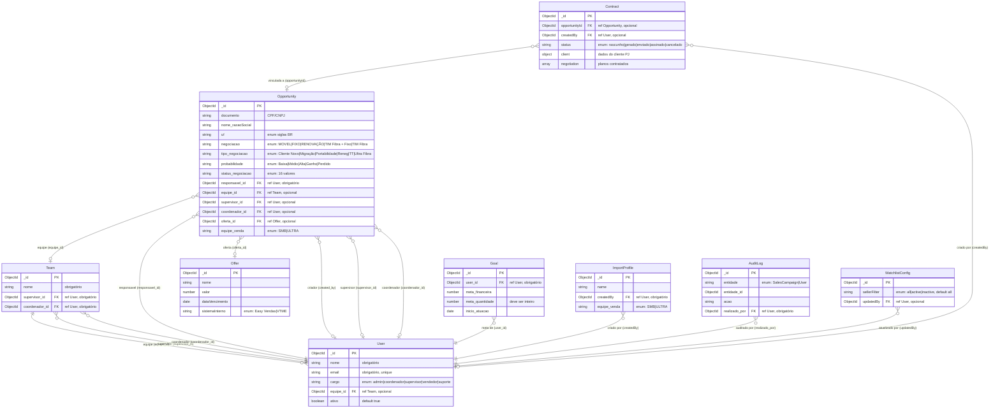

# Diagrama Entidade-Relacionamento

> **Nota de Arquitetura**: Todos os models abaixo pertencem ao **Servidor Central** (`src/`). O **Robô Standalone** (`robot-standalone/`) não possui models próprios — ele se comunica com o servidor via HTTP e opera sobre os mesmos dados através dos endpoints de instância (`/api/robot-docusign/instance/*`).

## Legenda

| Símbolo | Significado              |
| ------- | ------------------------ |
| `||`    | Um (obrigatório)         |
| `o|`    | Zero ou um (opcional)    |
| `}o`    | Zero ou mais (opcional)  |
| `}|`    | Um ou mais (obrigatório) |

## Databases

| Database        | Collection                  | Modelo          | Conexão                      |
| --------------- | --------------------------- | --------------- | ---------------------------- |
| `db_crm_funil`  | `users`                     | User            | `MONGO_URI` (mongoose.connect) |
| `db_crm_funil`  | `teams`                     | Team            | `MONGO_URI`                  |
| `db_crm_funil`  | `opportunities`             | Opportunity     | `MONGO_URI`                  |
| `db_crm_funil`  | `goals`                     | Goal            | `MONGO_URI`                  |
| `db_crm_funil`  | `offers`                    | Offer           | `MONGO_URI`                  |
| `db_crm_funil`  | `perfis_import`             | ImportProfile   | `MONGO_URI`                  |
| `db_crm_funil`  | `auditlogs`                 | AuditLog        | `MONGO_URI`                  |
| `db_crm_funil`  | `watchlistconfigs`          | WatchlistConfig | `MONGO_URI`                  |
| `crm_contracts` | `contracts`                 | Contract        | `useDb("crm_contracts")`     |

> **Nota:** Ambos os databases residem na **mesma instância MongoDB** (porta 27017).
