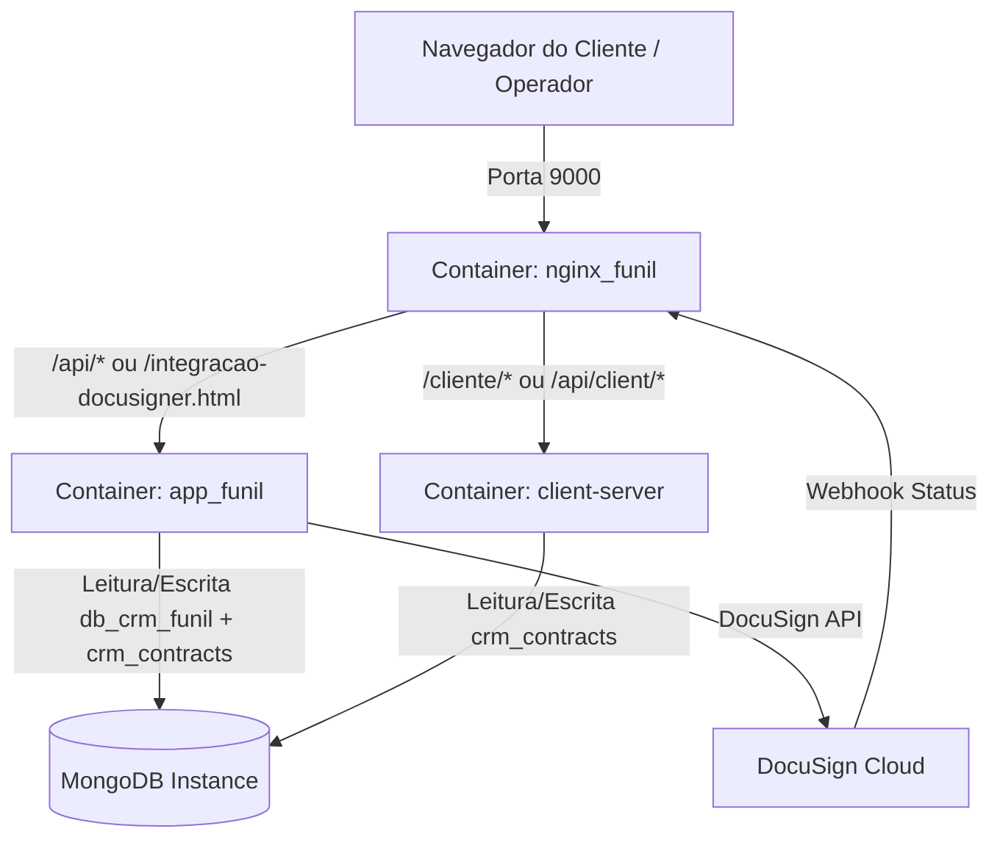

# Desenho Técnico (Design) - Integração DocuSigner

Este documento detalha o design arquitetural, o modelo de dados, as rotas de API, o fluxo de segurança/ACL e as regras de roteamento para a integração do módulo DocuSigner ao CRM Funil de Vendas.

> **Nota de Arquitetura (Marca d'Água)**: A responsabilidade de injeção de marca d'água dinâmica em anexos, previews e PDFs (`WatermarkService`) foi extraída do fluxo de contratos e pertence exclusivamente ao módulo dedicado `modulo-watermark` (`src/modules/watermark/`). O módulo de contratos delega o processamento visual de arquivos para o `WatermarkService` que valida globalmente a flag `watermark_enabled` do `SystemConfig`.

---

## 1. Arquitetura do Sistema e Fluxo de Dados

A solução será composta por 3 containers rodando no mesmo ambiente Docker Compose, acessando a mesma instância MongoDB, mas com bancos de dados separados.



### Divisão de Bancos de Dados (AD-002)
- **`db_crm_funil`**: Dados do CRM (usuários, equipes, oportunidades, metas).
- **`crm_contracts`**: Dados de contratos, documentos enviados pelos clientes e paths de arquivos assinados.

---

## 2. Modelo de Dados (Mongoose Schema)

O modelo de dados `Contract` será armazenado no banco de dados `crm_contracts`.

```javascript
import mongoose from 'mongoose';

const ContractSchema = new mongoose.Schema({
  cnpj: { type: String, required: true, index: true },
  companyName: { type: String, required: true },
  opportunityId: { type: mongoose.Schema.Types.ObjectId, ref: 'Opportunity', default: null },
  envelopeId: { type: String, default: null }, // ID do envelope no DocuSign
  status: { 
    type: String, 
    enum: ['draft', 'sent', 'signed', 'cancelled', 'expired'], 
    default: 'draft' 
  },
  hash: { type: String, required: true, unique: true }, // Hash seguro para acesso público do cliente
  negotiationDetails: {
    value: { type: Number },
    paymentMethod: { type: String },
    installments: { type: Number }
  },
  documents: [{
    type: { type: String, required: true }, // ex: 'cnpj', 'social_contract', 'id_partner'
    path: { type: String },
    status: { type: String, enum: ['pending', 'uploaded'], default: 'pending' },
    uploadedAt: { type: Date }
  }],
  signedContractPath: { type: String, default: null }, // Path local do PDF assinado baixado
  createdAt: { type: Date, default: Date.now },
  updatedAt: { type: Date, default: Date.now }
}, {
  timestamps: true,
  collection: 'contracts'
});

export default ContractSchema;
```

---

## 3. APIs e Rotas Express

As APIs serão divididas de acordo com as responsabilidades dos containers.

### Container: `app_funil` (CRM - Autenticado via JWT)
Montado sob o prefixo `/api/integracao-docusigner` nas rotas do CRM:

| Rota | Método | Descrição | Regras de ACL |
| --- | --- | --- | --- |
| `/api/integracao-docusigner` | POST | Cria rascunho de contrato | `admin`, `suporte` |
| `/api/integracao-docusigner` | GET | Lista contratos cadastrados | Baseado no cargo (vendedor = só seus) |
| `/api/integracao-docusigner/:id` | GET | Detalhes do contrato | Baseado no cargo |
| `/api/integracao-docusigner/:id` | PUT | Atualiza dados do contrato | `admin`, `suporte` |
| `/api/integracao-docusigner/:id/send` | POST | Gera PDFs e envia para DocuSign | `admin`, `suporte` |
| `/api/docusign/webhook` | POST | Webhook de atualização recebido do DocuSign | Pública (sem auth, valida assinatura DocuSign) |

### Container: `client-server` (Portal do Cliente - Público via Hash)
Montado sob o prefixo `/api/client/contracts` no portal público:

| Rota | Método | Descrição |
| --- | --- | --- |
| `/api/client/contracts/:hash` | GET | Valida hash e retorna status do contrato + documentos pendentes |
| `/api/client/contracts/:hash/upload` | POST | Upload de arquivo (Multer limitado a 10MB por arquivo) |
| `/api/client/contracts/:hash/download` | GET | Baixa o contrato assinado caso status seja `signed` |

---

## 4. Segurança, Autorização e ACL (AD-004)

- **Vendedor**: Ao listar ou obter detalhes de contratos, o controller de contratos consultará as oportunidades pertencentes ao vendedor logado, obtendo a lista de CNPJs dessas oportunidades. O retorno será filtrado para conter apenas contratos cujo campo `cnpj` corresponda a essas oportunidades de sua posse.
- **Supervisor/Coordenador**: Filtrará contratos onde o CNPJ corresponda a oportunidades de qualquer membro sob sua supervisão.
- **Admin/Suporte**: Acesso irrestrito a todos os contratos do banco.
- **Cliente (Externo)**: O acesso ao portal público do cliente é concedido apenas a quem possuir a URL contendo o CNPJ e o hash criptograficamente seguro gerado no ato de envio do contrato.

---

## 5. Roteamento no Nginx

O arquivo `default.conf` do Nginx será atualizado para suportar o roteamento do portal do cliente para o container `client-server`:

```nginx
# Roteamento do Portal do Cliente (HTML/JS estáticos)
location /cliente/ {
    proxy_pass http://client-server:3001/;
    proxy_set_header Host $host;
    proxy_set_header X-Real-IP $remote_addr;
}

# Roteamento da API do Cliente (Upload/Download público)
location /api/client/ {
    proxy_pass http://client-server:3001/api/client/;
    proxy_set_header Host $host;
    proxy_set_header X-Real-IP $remote_addr;
    client_max_body_size 10M; # Limite de 10MB para arquivos do cliente
}
```

---

## 6. Geração de PDF e Integração DocuSign

- A geração do PDF do contrato será feita a partir de dados preenchidos no frontend e consolidados no backend usando a biblioteca `pdfkit` ou similar no backend (ou base64 estático preenchido no backend a partir do template existente do Docusigner).
- O envio do envelope para a API da DocuSign será feito utilizando a SDK oficial `@docusign/esign-esignature` ou requisições HTTP diretas autenticadas via JWT Grant da DocuSign.

---

## 7. Variáveis de Ambiente — DocuSign

Todas as variáveis abaixo são lidas via `process.env` em runtime e **não estão incluídas** no `.env.example` nem nos `docker-compose*` atuais. Precisam ser configuradas manualmente nos seguintes locais:

| Variável | Obrigatória | Padrão | Onde configurar | Descrição |
| -------- | ----------- | ------ | --------------- | --------- |
| `DOCUSIGN_INTEGRATION_KEY` | Sim | — | `.env` + `docker-compose.override.yml` + `docker-compose.prod.yml` (no service `app_funil`) | Integration Key do App DocuSign (equivalente ao `client_id` OAuth). Obtida em Settings → Apps & Keys |
| `DOCUSIGN_USER_ID` | Sim | — | `.env` + docker-compose (service `app_funil`) | ID do usuário DocuSign que fará a autenticação JWT (formato UUID, encontrado em Settings → API → Account Info → User ID) |
| `DOCUSIGN_ACCOUNT_ID` | Sim | — | `.env` + docker-compose (service `app_funil`) | Account ID da conta DocuSign (também em Settings → API → Account Info) |
| `DOCUSIGN_RSA_PRIVATE_KEY_PATH` | Sim | `./private.key` | `.env` + docker-compose (service `app_funil`) + arquivo no filesystem | Caminho (relativo ou absoluto) para o arquivo da chave privada RSA gerada no App DocuSign |
| `DOCUSIGN_HMAC_KEY` | Sim | — | `.env` + docker-compose (service `app_funil`) | Chave secreta HMAC do conector DocuSign (Settings → Connect → HMAC). Sem ela o webhook é rejeitado (HTTP 401) |
| `DOCUSIGN_BASE_PATH` | Não | `https://demo.docusign.net/restapi` | `.env` + docker-compose (service `app_funil`) | Base URL da API DocuSign. Em produção, trocar para `https://na2.docusign.net/restapi` (ou o endpoint correto do data center) |
| `DOCUSIGN_REDIRECT_URI` | Sim (se usar consent flow) | — | `.env` + docker-compose (service `app_funil`) | Redirect URI cadastrado no App DocuSign (ex: `https://meudominio.com/api/docusign/callback`). Deve ser idêntico ao configurado no portal DocuSign |
| `DOCUSIGN_AUTH_BASE_URL` | Não | `https://account-d.docusign.com/oauth/auth` | `.env` + docker-compose (service `app_funil`) | URL base de autenticação OAuth. Para produção, usar `https://account.docusign.com/oauth/auth` |

### Onde Configurar — Checklist

**1. Arquivo `.env`** (ambiente local ou secrets Docker):
```
DOCUSIGN_INTEGRATION_KEY=seu_integration_key
DOCUSIGN_USER_ID=seu_user_id_uuid
DOCUSIGN_ACCOUNT_ID=seu_account_id
DOCUSIGN_RSA_PRIVATE_KEY_PATH=./private.key
DOCUSIGN_HMAC_KEY=sua_hmac_key
DOCUSIGN_BASE_PATH=https://demo.docusign.net/restapi
DOCUSIGN_REDIRECT_URI=https://meudominio.com/api/docusign/callback
DOCUSIGN_AUTH_BASE_URL=https://account-d.docusign.com/oauth/auth
```

**2. Arquivos `docker-compose.override.yml` e `docker-compose.prod.yml`** — adicionar no service `app_funil`:
```yaml
environment:
  - DOCUSIGN_INTEGRATION_KEY=${DOCUSIGN_INTEGRATION_KEY}
  - DOCUSIGN_USER_ID=${DOCUSIGN_USER_ID}
  - DOCUSIGN_ACCOUNT_ID=${DOCUSIGN_ACCOUNT_ID}
  - DOCUSIGN_RSA_PRIVATE_KEY_PATH=${DOCUSIGN_RSA_PRIVATE_KEY_PATH}
  - DOCUSIGN_HMAC_KEY=${DOCUSIGN_HMAC_KEY}
  - DOCUSIGN_BASE_PATH=${DOCUSIGN_BASE_PATH}
```

**3. Arquivo `private.key`** — gerado no portal DocuSign (Settings → Apps & Keys → Integration Key → Generate RSA), copiado para a raiz do projeto (ou caminho especificado em `DOCUSIGN_RSA_PRIVATE_KEY_PATH`). **NÃO versionar** — incluído em `.gitignore`.

### Mapa de Leitura no Código

| Variável | Lida em | Uso |
| -------- | ------- | --- |
| `DOCUSIGN_INTEGRATION_KEY` | `src/modules/contract/services/docusignService.js:28,40,90` | Validação de config + `getConsentUrl()` + `requestJWTUserToken()` |
| `DOCUSIGN_USER_ID` | `docusignService.js:30,91` | Validação + `requestJWTUserToken()` |
| `DOCUSIGN_ACCOUNT_ID` | `docusignService.js:31,213,223,230,237` | Validação + todas as chamadas à API de envelopes |
| `DOCUSIGN_RSA_PRIVATE_KEY_PATH` | `docusignService.js:32,79` | Validação + `readFileSync()` para ler a chave RSA |
| `DOCUSIGN_HMAC_KEY` | `docusignService.js:34`, `docusignController.js:372` | Validação + `verifyWebhookSignature()` no webhook |
| `DOCUSIGN_BASE_PATH` | `docusignService.js:22` | `apiClient.setBasePath()` no construtor |
| `DOCUSIGN_REDIRECT_URI` | `docusignService.js:39,47` | `getConsentUrl()` |
| `DOCUSIGN_AUTH_BASE_URL` | `docusignService.js:53` | `getConsentUrl()` — URL base OAuth |
