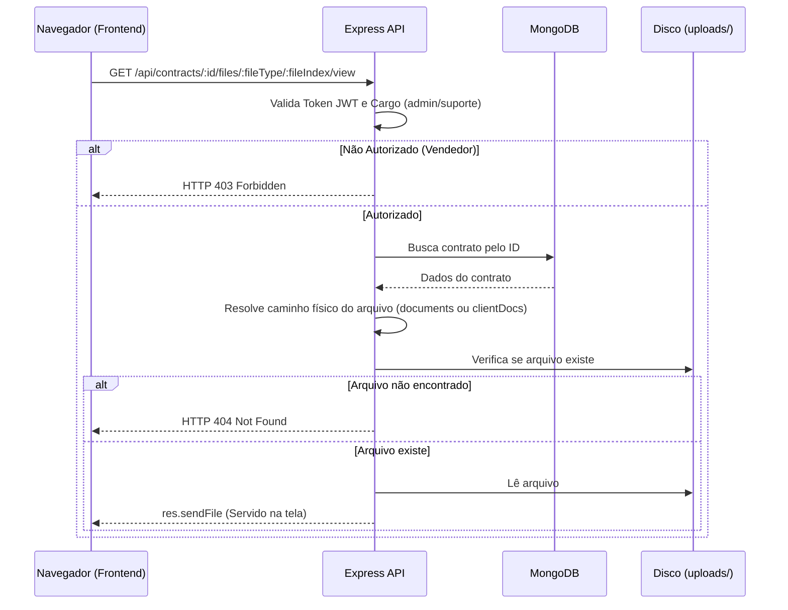
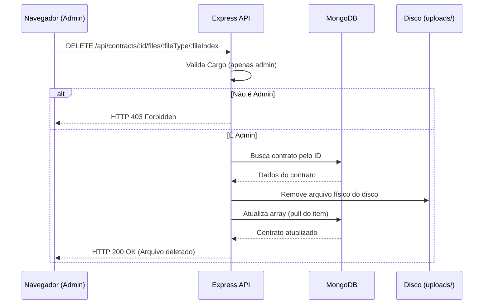

# Dashboard de Contratos DocuSign — Design

Este documento detalha o design técnico para o Dashboard de Contratos DocuSign, mapeando as rotas da API, a estrutura do frontend e as regras de controle de acesso (ACL).

## Arquitetura de Componentes

### 1. Rotas do Backend (`src/modules/contract/routes.js`)
Novas rotas adicionadas para gerenciar a segurança dos arquivos anexos:
- `GET /api/contracts/:id/files/:fileType/:fileIndex/view`
- `GET /api/contracts/:id/files/:fileType/:fileIndex/download`
- `DELETE /api/contracts/:id/files/:fileType/:fileIndex`

### 2. Controle de Acesso (ACL)
Mapeamento de cargos e permissões para as ações nos arquivos anexos:

| Cargo | Visualizar Anexos (View) | Baixar Anexos (Download) | Deletar Anexos (Delete) |
| --- | --- | --- | --- |
| **vendedor** | Não (403) | Não (403) | Não (403) |
| **suporte** | Sim | Não (403) | Não (403) |
| **admin** | Sim | Sim | Sim |
| **supervisor** / **coordenador** | Não (403) | Não (403) | Não (403) |

*Nota: Vendedores, supervisores e coordenadores visualizam apenas as informações do contrato na tabela e os nomes dos arquivos. Apenas suporte e admin podem interagir com os arquivos em si.*

### 3. Frontend (`public/modules/contratos/`)
- `dashboard-contratos-docusigner.html`: Estrutura de layout e tabela do dashboard.
- `dashboard-contratos-docusigner.js`: Lógica para buscar contratos, renderizar a tabela, aplicar a ACL de botões no cliente e manipular eventos de visualização, download e exclusão.

## Fluxo de Visualização e Download de Arquivos


## Fluxo de Deleção de Arquivos


### 4. Frontend — Card Layout Refatorado

Estrutura HTML do card refatorado para o Step 6 Dashboard, conforme CONTR-DASH-13 e CONTR-DASH-14:

```
.contract-card                          /* fundo #f3f4f6 / lilás claro, border-radius 12px, padding */
├── .card-header                        /* fundo #fff, border-radius, padding interno */
│   ├── .card-header-top                /* flex, justify-content: space-between, align-items: center */
│   │   ├── .client-name                /* caixa alta, font-weight: 700, fonte grande */
│   │   └── .header-actions             /* flex, gap pequeno */
│   │       ├── .btn-link-opp           /* fundo laranja claro (#fef3c7), texto laranja escuro (#d97706) */
│   │       ├── .btn-copy-link          /* fundo roxo claro (#ede9fe), texto roxo escuro (#7c3aed) */
│   │       └── .btn-resend             /* fundo verde claro (#d1fae5), texto verde escuro (#059669) */
│   └── .card-header-bottom             /* flex-wrap, gap, margin-top */
│       ├── .badge-cnpj                 /* fundo #e2e8f0, texto #334155, font-size 0.75rem */
│       ├── .badge-phone                /* fundo #e2e8f0, texto #334155, ícone + telefone */
│       ├── .badge-status               /* fundo #dbeafe, texto #1d4ed8, maiúsculo */
│       └── .badge-hash                 /* fundo #e2e8f0, texto #64748b, font monospace */
├── .card-plan                          /* padding vertical, cor #334155, font-size 0.85rem */
│   └── texto: "TIM Black Empresa III - B REG..." (plano + oferta do contrato)
└── .card-documents
    ├── .docs-title                     /* caixa alta, font-size 0.7rem, font-weight 700, cor #64748b */
    └── .docs-container                 /* fundo #fafafa/translúcido, border-radius, inner shadow */
        └── flex-wrap com gap 8px
            ├── .doc-tag.present        /* fundo #f0fdf4, borda 1px #86efac, texto #166534, border-radius 6px */
            │   ├── .doc-tag-info       /* ícone PDF + nome do documento */
            │   └── .doc-tag-actions    /* btn-view, btn-download, btn-delete */
            └── .doc-tag.pending        /* fundo #fdf2f8, borda 1px #fda4af, texto #9d174d, border-radius 6px */
                └── .doc-tag-info       /* ícone documento + nome (sem ações) */
```

#### Mapeamento de Classes CSS

| Classe | Propósito |
|--------|-----------|
| `.card-header` | Container branco do cabeçalho do cliente |
| `.card-header-top` | Linha superior: nome + action buttons |
| `.card-header-bottom` | Linha inferior: badges de metadados |
| `.header-action-btn` | Base para os 3 action buttons (link-opp, copy-link, resend) |
| `.badge-tag` | Base para badges de metadados (cnpj, phone, status, hash) |
| `.card-plan` | Texto descritivo do plano/serviço |
| `.card-documents` | Seção de documentos |
| `.docs-title` | Título "DOCUMENTOS GERADOS" |
| `.docs-container` | Container com inner shadow |
| `.doc-tag` | Tag de documento (base) |
| `.doc-tag.present` | Tag verde para documento presente |
| `.doc-tag.pending` | Tag vermelha para documento pendente |

#### Renderização de Documentos

A função `renderAttachmentItem()` deve gerar duas variantes de HTML:

**Documento presente (verde):**
```html
<div class="doc-tag present">
  <span class="doc-tag-info">
    <i class="ph ph-file-pdf" style="color: #16a34a"></i>
    <span>TERMO_DE_CONTRATACAO.pdf</span>
  </span>
  <div class="doc-tag-actions">
    <button class="action-btn btn-view" data-id="..." data-type="documents" data-index="0"><i class="ph ph-eye"></i></button>
    <button class="action-btn btn-download" data-id="..." data-type="documents" data-index="0"><i class="ph ph-download"></i></button>
    <button class="action-btn btn-delete" data-id="..." data-type="documents" data-index="0"><i class="ph ph-trash"></i></button>
  </div>
</div>
```

**Documento pendente (vermelho):**
```html
<div class="doc-tag pending">
  <span class="doc-tag-info">
    <i class="ph ph-identification-card" style="color: #be123c"></i>
    <span>RG</span>
  </span>
  <!-- sem ações, apenas upload quando autorizado -->
</div>
```
