# Dashboard de Contratos DocuSign — Refatoramento SOLID Design

**Spec**: `.specs/features/contratos/sub-specs/dashboard-contratos-refactor/spec.md`
**Status**: Draft

---

## Architecture Overview

Refatoramento estrutural: extrair 39 funções de um arquivo monolítico (1397 linhas) em ~25 módulos ES6 com responsabilidade única. Sem alteração de lógica — apenas desacoplamento de imports/exports.

```mermaid
graph TD
    SESSION["/js/core/session.js<br/>(getUser, getToken)"] --> STATE
    SESSION --> API
    SESSION --> FILE_ACTIONS

    subgraph FASE1["Leaf Modules (zero deps internos)"]
        CONSTANTS["constants.js<br/>REQUIRED_DOCS_BY_TYPE"]
        CLIPBOARD["utils/clipboard.js<br/>copyToClipboard"]
        FORMATTERS["utils/formatters.js<br/>7 helpers"]
        STATE["state.js<br/>7 vars mutaveis"]
    end

    subgraph FASE2["Render & Modals"]
        RENDER_ATTACH["render/render-attachment-item.js"]
        MODALS["modals.js<br/>5 funcoes de modal"]
        FILT_TOGGLE["filters/toggle-contracts-filters.js"]
        FILT_VIS["filters/apply-contracts-filter-visibility.js"]
    end

    STATE --> RENDER_ATTACH
    STATE --> MODALS
    STATE --> FILT_TOGGLE
    STATE --> FILT_VIS

    subgraph FASE3["Core"]
        RENDER["render/render-contracts.js<br/>(165 linhas)"]
        FILT_APPLY["filters/apply-contract-filters.js"]
        FILT_CLEAR["filters/clear-contract-filters.js"]
        FILT_POPULATE["filters/populate-contract-filters.js"]
        FILT_FILTER["filters/filter-contracts.js"]
        API_MOD["api.js<br/>loadContracts, fetchClientDocLink"]
    end

    RENDER_ATTACH --> RENDER
    STATE --> RENDER
    FORMATTERS --> RENDER
    FORMATTERS --> VIEW_OPP
    RENDER --> API_MOD
    STATE --> API_MOD
    RENDER --> FILT_APPLY
    STATE --> FILT_APPLY
    FILT_APPLY --> FILT_FILTER
    RENDER --> FILT_CLEAR
    STATE --> FILT_CLEAR
    STATE --> FILT_POPULATE

    subgraph FASE4["File Actions & Events"]
        VIEW_FILE["file-actions/view-attachment-file.js"]
        DOWNLOAD["file-actions/download-attachment-file.js"]
        UPLOAD["file-actions/handle-dashboard-upload.js"]
        DEL_FILE["file-actions/execute-attachment-deletion.js"]
        SETUP_EVENTS["events/setup-event-listeners.js"]
        SETUP_DYNAMIC["events/setup-dynamic-button-events.js"]
    end

    STATE --> VIEW_FILE
    STATE --> DOWNLOAD
    STATE --> UPLOAD
    API_MOD --> UPLOAD
    API_MOD --> DEL_FILE
    STATE --> DEL_FILE
    MODALS --> SETUP_EVENTS
    FILE_ACTIONS --> SETUP_EVENTS
    OPP_LINK --> SETUP_EVENTS
    MODALS --> SETUP_DYNAMIC
    FILE_ACTIONS --> SETUP_DYNAMIC
    OPP_LINK --> SETUP_DYNAMIC
    CLIPBOARD --> SETUP_DYNAMIC
    API_MOD --> SETUP_DYNAMIC

    subgraph FASE5["Domain Modals"]
        OPP_LINK["opportunity-link.js<br/>4 funcoes"]
        VIEW_OPP["view-opportunity.js<br/>3 funcoes"]
        VIEW_CTR["view-contract.js<br/>3 funcoes"]
    end

    STATE --> OPP_LINK
    API_MOD --> OPP_LINK
    STATE --> VIEW_OPP
    STATE --> VIEW_CTR
    FORMATTERS --> VIEW_CTR

    subgraph FASE6["Entrypoint"]
        INDEX["index.js<br/>DOMContentLoaded + window exports"]
    end

    INDEX --> ALL

    INDEX --> HTML["contratos.html<br/>(sem onclick)"]
```

---

## Code Reuse Analysis

| Componente | Localizacao | Como Reutilizar |
|---|---|---|
| `getUser()`, `getToken()` | `/js/core/session.js` | Importado por `state.js`, `api.js`, `file-actions/*` |
| `window.api.getCompatibleOpportunities` | serviço externo injetado | Mantido via `window.api` — chamado em `opportunity-link.js` |
| `window.api.linkOpportunity` | serviço externo injetado | Mantido via `window.api` — chamado em `opportunity-link.js` |
| `window.api.getClientDocLink` | serviço externo injetado | Mantido via `window.api` — chamado em `events/setup-dynamic-button-events.js` |
| `window.pdfjsLib` | CDN Mozilla | Mantido via `window.pdfjsLib` — usado em `file-actions/view-attachment-file.js` |
| CSS `dashboard-contratos-docusigner.css` | `/modules/contratos/` | Mantido exatamente no mesmo path, sem alterações |

### Integration Points

| Sistema | Metodo |
|---|---|
| `contratos.html` (stepper) | Altera `<script>` src e remove `onclick` inline |
| Navegacao stepper step 6 | `window.loadContractsDashboard` exportado pelo `index.js` |
| Sidebar | Nenhuma alteração necessária |

---

## Components

### state.js
- **Purpose**: Centraliza todo estado mutável do dashboard
- **Location**: `public/modules/contratos/dashboard/state.js`
- **Interfaces**:
  - `allContracts: Array` — lista completa de contratos
  - `currentUser: Object` — usuário logado (do session.js)
  - `deleteTarget: Object|null` — alvo do modal de deleção
  - `selectedContractIdForLink: String|null`
  - `selectedOpportunityIdForLink: String|null`
  - `currentOpportunitiesList: Array`
  - `currentAttachmentTarget: Object|null`
- **Dependencies**: `/js/core/session.js` (getUser, getToken)
- **Reuses**: Nada novo — extração pura

### constants.js
- **Purpose**: Tipos empresariais e documentos exigidos
- **Location**: `public/modules/contratos/dashboard/constants.js`
- **Interfaces**: `REQUIRED_DOCS_BY_TYPE: Object`
- **Dependencies**: Nenhuma
- **Reuses**: Nada novo

### api.js
- **Purpose**: Chamadas fetch para contratos e links
- **Location**: `public/modules/contratos/dashboard/api.js`
- **Interfaces**:
  - `loadContracts(): Promise<void>` — GET /api/contracts, atualiza state.allContracts, chama renderContracts
  - `fetchClientDocLink(contractId): Promise<{linkUrl}>`
- **Dependencies**: `state.js`, `render/render-contracts.js`, `/js/core/session.js`
- **Reuses**: `getToken()` de session.js

### events/setup-event-listeners.js
- **Purpose**: Registrar listeners estáticos (inputs, botões de modal)
- **Location**: `public/modules/contratos/dashboard/events/setup-event-listeners.js`
- **Interfaces**: `setupEventListeners(): void`
- **Dependencies**: `state.js`, `modals.js`, `opportunity-link.js`, `file-actions/*`
- **Reuses**: Padrão `addEventListener` (AD-010)

### events/setup-dynamic-button-events.js
- **Purpose**: Registrar listeners em elementos renderizados dinamicamente (cards)
- **Location**: `public/modules/contratos/dashboard/events/setup-dynamic-button-events.js`
- **Interfaces**: `setupDynamicButtonEvents(): void`
- **Dependencies**: `state.js`, `modals.js`, `file-actions/*`, `opportunity-link.js`, `utils/clipboard.js`, `api.js`
- **Reuses**: Padrão `addEventListener` via querySelectorAll

### render/render-contracts.js
- **Purpose**: Gerar HTML dos cards de contrato no DOM
- **Location**: `public/modules/contratos/dashboard/render/render-contracts.js`
- **Interfaces**: `renderContracts(contracts): void`
- **Dependencies**: `state.js`, `render/render-attachment-item.js`, `utils/formatters.js`
- **Reuses**: Template string original (preservado 100%)

### render/render-attachment-item.js
- **Purpose**: Gerar HTML de tag de anexo (verde presente / vermelho pendente)
- **Location**: `public/modules/contratos/dashboard/render/render-attachment-item.js`
- **Interfaces**: `renderAttachmentItem(contractId, fileType, index, name, iconClass, role, isPresent, docType): string`
- **Dependencies**: `state.js`
- **Reuses**: Lógica original de renderAttachmentItem

### filters/*.js (6 arquivos)
- **Purpose**: Cada arquivo contém exatamente uma função de filtro
- **Location**: `public/modules/contratos/dashboard/filters/`
- **Interfaces**:
  - `applyContractFilters(): void` — aplica filtros e chama renderContracts
  - `toggleContractsFilters(): void` — alterna visibilidade da barra
  - `clearContractFilters(): void` — reseta e renderiza todos
  - `populateContractFilters(): Promise<void>` — popula selects de cargo
  - `applyContractsFilterVisibility(): void` — mostra/esconde por role
  - `filterContracts(): void` — delega para applyContractFilters
- **Dependencies**: `state.js`, `render/render-contracts.js`
- **Reuses**: Lógica original de filtros

### file-actions/*.js (4 arquivos)
- **Purpose**: Cada arquivo contém exatamente uma ação sobre arquivos
- **Location**: `public/modules/contratos/dashboard/file-actions/`
- **Interfaces**:
  - `viewAttachmentFile(contractId, fileType, index, name): Promise<void>` — PDF.js ou imagem
  - `downloadAttachmentFile(contractId, fileType, index): void` — link temporário
  - `handleDashboardUpload(contractId, docType, docName): void` — input file + upload
  - `executeAttachmentDeletion(): Promise<void>` — DELETE + recarrega
- **Dependencies**: `state.js`, `api.js`, `window.pdfjsLib`
- **Reuses**: Lógica original de file actions

### modals.js
- **Purpose**: Abrir/fechar modais de confirmação
- **Location**: `public/modules/contratos/dashboard/modals.js`
- **Interfaces**: `openDeleteModal`, `closeDeleteModal`, `openAttachmentActionsModal`, `closeAttachmentActionsModal`, `closeViewModal`
- **Dependencies**: `state.js`
- **Reuses**: Nada novo

### opportunity-link.js
- **Purpose**: Modal de vinculação de oportunidade
- **Location**: `public/modules/contratos/dashboard/opportunity-link.js`
- **Interfaces**: `openLinkOpportunityModal`, `closeLinkOppModal`, `renderOpportunitiesList`, `executeLinkOpportunity`
- **Dependencies**: `state.js`, `api.js`
- **Reuses**: `window.api.getCompatibleOpportunities`, `window.api.linkOpportunity`

### view-opportunity.js
- **Purpose**: Modal de visualização de oportunidade (relatório completo)
- **Location**: `public/modules/contratos/dashboard/view-opportunity.js`
- **Interfaces**: `openViewOpportunityModal`, `closeViewOpportunityModal`, `buildOpportunityReportHTML`
- **Dependencies**: `state.js`, `utils/formatters.js`
- **Reuses**: 7 helpers de formatters.js

### view-contract.js
- **Purpose**: Modal de visualização de contrato (relatório de dados do formulário de contrato)
- **Location**: `public/modules/contratos/dashboard/view-contract.js`
- **Interfaces**: `openViewContractModal`, `closeViewContractModal`, `buildContractReportHTML`
- **Dependencies**: `utils/formatters.js`
- **Reuses**: formatters.js helpers (formatCurrencySimple, formatDateSimple, createReportField, createReportSection)

### utils/clipboard.js
- **Purpose**: Copiar texto para área de transferência
- **Location**: `public/modules/contratos/dashboard/utils/clipboard.js`
- **Interfaces**: `copyToClipboard(text, successMessage): Promise<void>`
- **Dependencies**: Nenhuma
- **Reuses**: API nativa `navigator.clipboard`

### utils/formatters.js
- **Purpose**: Helpers puros de formatação e geração de HTML
- **Location**: `public/modules/contratos/dashboard/utils/formatters.js`
- **Interfaces**: `formatCurrencySimple`, `formatDateSimple`, `createBadgeSimple`, `formatObservationsSimple`, `createReportField`, `createReportSection`, `createItemsTableSimple`
- **Dependencies**: Nenhuma (funções puras)
- **Reuses**: Nada novo

### index.js (Entrypoint)
- **Purpose**: Ponto único de entrada — importa todos os módulos e inicia
- **Location**: `public/modules/contratos/dashboard/index.js`
- **Interfaces**: `window.loadContractsDashboard`, `window.toggleContractsFilters`, `window.applyContractFilters`, `window.clearContractFilters`
- **Dependencies**: Todos os módulos acima
- **Reuses**: `DOMContentLoaded` original

---

## Error Handling Strategy

| Erro | Handling | Impacto |
|---|---|---|
| Módulo não encontrado (import fail) | Erro de rede — console + página não carrega | Usuário vê fallback vazio |
| Elemento DOM ausente no addEventListener | `if (el)` guard (preservado do original) | Sem erro, evento ignorado |
| API retorna erro | Mantido `alert()` + console.error (original) | Idêntico ao comportamento atual |

---

## Risks & Concerns

| Concern | Location | Impact | Mitigation |
|---|---|---|---|
| Template string gera onclick inline (`openViewOpportunityModal`) | `render-contracts.js:484` | `openViewOpportunityModal` precisa estar no escopo global (módulo ES6 não expõe) | Exportar para `window.openViewOpportunityModal` no `index.js` — única exceção necessária para manter retrocompatibilidade |
| `closeViewOpportunityModal()` chamado via `onclick` no HTML | `contratos.html:1278,1284` | Precisa estar no escopo global | Exportar `window.closeViewOpportunityModal` no `index.js` OU substituir por addEventListener (preferível) |
| `window.api.*` (getCompatibleOpportunities, linkOpportunity, getClientDocLink) | Varios pontos | Serviço externo injetado via window | Manter acesso via `window.api` como no original |
| `window.pdfjsLib` | `view-attachment-file.js` | CDN Mozilla injetada no window | Configurar workerSrc como no original |

---

## Tech Decisions

| Decision | Choice | Rationale |
|---|---|---|
| Entrypoint único vs múltiplos scripts | Único `index.js` | Padrão ES modules: um entrypoint importa tudo; HTML carrega só ele |
| `window.*` exports | Manter 4 funções de filtro + 2 de modal oportunidade | `loadContractsDashboard` é chamado pelo stepper; onclick do HTML será substituído por addEventListener onde possível |
| `openViewOpportunityModal` no template string | Exportar para `window.openViewOpportunityModal` | Template string gera HTML com `onclick="openViewOpportunityModal(...)"` que é avaliado no escopo global — manter compatibilidade sem alterar renderização |
| Estrutura de pastas | `events/`, `render/`, `filters/`, `file-actions/`, `utils/` | Agrupamento por domínio dentro do módulo dashboard |
| CSS | **Não** alterado | Refatoramento é só JS — zero risco de regressão visual |
| Nomes de arquivo kebab-case | `setup-event-listeners.js` | Convenção do projeto (ex: `sales-kanban.js`, `dashboard-contratos-docusigner.js`) |
