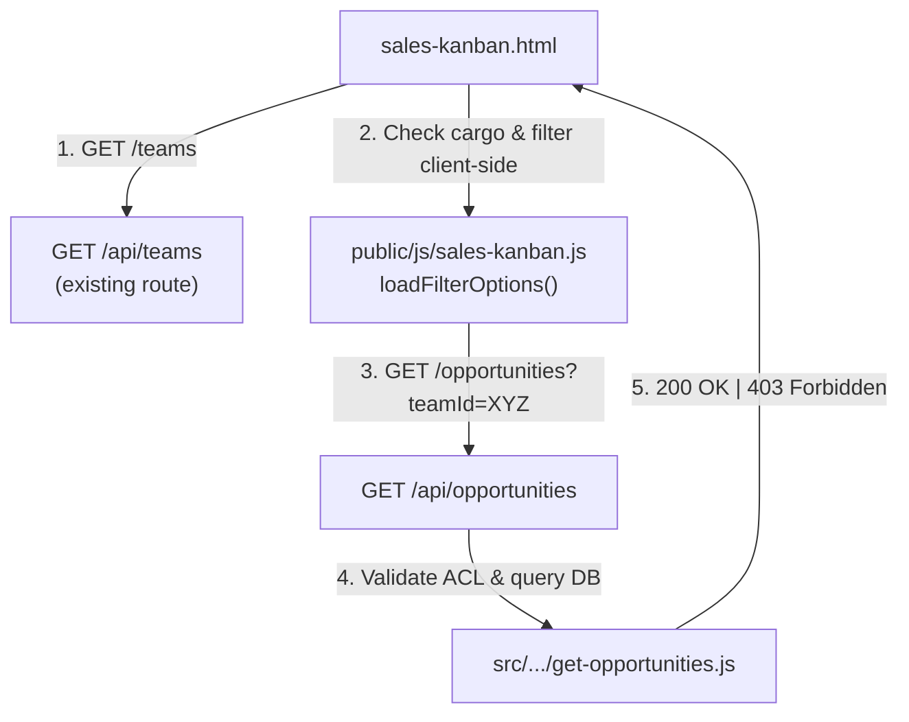

# Kanban Team Filter for Supervisors — Design

**Spec**: `.specs/features/kanban-team-filter/spec.md`
**Status**: Approved

---

## Architecture Overview

The feature adds a team filter dropdown to the Sales Pipeline Kanban board for users with the `supervisor` role. Supervisors who manage multiple sales teams can isolate the view to a single team's opportunities or see a consolidated overview of all supervised teams. The architecture follows a straightforward request/response pattern: the frontend fetches available teams, populates a dropdown, and re-fetches opportunities on selection change. The backend enforces strict ACL — a supervisor can never see data from teams they do not supervise.



---

## Code Reuse Analysis

### Existing Components to Leverage

| Component | Location | How to Use |
|-----------|----------|------------|
| Team Model | `src/models/Team.js` | Query `Team.find({ supervisor_id: userId })` to resolve supervised teams; no schema changes needed |
| Opportunity Model | `src/models/Opportunity.js` | Filter via `equipe_id` field; no schema changes needed |
| User Model | `src/models/User.js` | Validate seller belongs to supervised team via Mongoose query |
| `GET /api/teams` route | Already exists in the app | Fetches all teams; supervisor filters client-side by `supervisor_id._id` |
| `GET /api/opportunities` | Already exists in the app | Extended with supervisor ACL branch; existing admin/coordinator/suporte branches untouched |
| `#filterTeam` dropdown | Already in `sales-kanban.html` | Previously hidden for supervisors; now displayed with dynamic options |
| `App.getUser()` | Global helper (`App` object) | Returns `cargo`, `_id` for role detection and team filtering |
| `App.request()` | Global helper (`App` object) | Used for all HTTP requests; error handling via try/catch |

### Integration Points

| System | Integration Method |
|--------|-------------------|
| MongoDB (Teams collection) | Mongoose `Team.find()` — supervisor lookup via `supervisor_id` |
| MongoDB (Opportunities collection) | Mongoose `Opportunity.find()` — team-scoped via `equipe_id` |
| Frontend (sales-kanban.js) | DOM event `change` on `#filterTeam` triggers `loadOpportunities()` |
| HTTP transport | `GET /api/opportunities?teamId=<id>` via `App.request()` |

---

## Components

### Frontend: `public/js/sales-kanban.js`

- **Purpose**: Manage the Kanban board lifecycle — fetch teams, populate filter dropdown, fetch opportunities, render cards, handle drag-and-drop.
- **Location**: `public/js/sales-kanban.js`
- **Interfaces**:
  - `loadFilterOptions()` — async, fetches teams from `/api/teams`, filters by `supervisor_id._id` for supervisors, populates `#filterTeam` dropdown, binds `change` event to `loadOpportunities`.
  - `loadOpportunities()` — async, reads `#filterTeam.value`, calls `GET /api/opportunities?teamId=<value>`, passes result to `renderKanban()`.
  - `renderKanban(list)` — synchronous, clears all columns, maps opportunities to status columns, creates cards via `createCard()`.
- **Dependencies**: `App.getUser()`, `App.request()`, global `App` object, `#filterTeam` DOM element.
- **Reuses**: Existing `#filterTeam` HTML element, existing `App.request()` HTTP helper, existing card layout (`createCard`).
- **Error handling**: `loadFilterOptions` wrapped in try/catch — logs to console and continues; `loadOpportunities` wrapped in try/catch — logs to console.

### Backend Controller: `get-opportunities.js`

- **Purpose**: Handle `GET /api/opportunities` with full role-based access control for all roles (admin, suporte, coordenador, supervisor, vendedor).
- **Location**: `src/modules/opportunities/controllers/get-opportunities.js`
- **Interfaces**:
  - Export: `getOpportunities(req, res)` — async controller function.
  - Input: `req.user` (with `_id`, `cargo`, `equipe_id`), `req.query` (with optional `teamId`, `sellerId`, `supervisorId`, `coordinatorId`, `startDate`, `endDate`, `status`, `probabilidade`).
  - Output: `res.json(opportunities)` on success (200), `res.status(403).json({ message })` on ACL violation, `res.status(500).json({ message })` on unexpected error.
- **Dependencies**: `Opportunity`, `Team`, `User` Mongoose models.
- **Reuses**: Existing `Team.find()`, `Opportunity.find().populate().sort()` pattern. No new models, middleware, or utilities.

### Supervisor-Specific Logic (within `get-opportunities.js`)

```
cargo === "supervisor"
  -> Team.find({ supervisor_id: _id })
  -> if teamId provided:
       -> if teamId NOT in supervisedTeamIds -> 403
       -> else query.equipe_id = teamId
  -> else if supervisedTeamIds.length > 0:
       -> query.equipe_id = { $in: supervisedTeamIds } (consolidated)
  -> else:
       -> query.responsavel_id = _id (seller fallback)
```

### Additional ACL Paths (existing roles, extended for consistency)

- **Supervisor + sellerId**: Verify seller belongs to supervised teams via Mongoose query, return 403 if not found.
- **Coordinator + teamId**: Verify teamId belongs to coordinator's teams (`coordenador_id`).
- **Admin/Suporte + teamId**: Direct `query.equipe_id = teamId` (no ownership check).
- **SupervisorId filter** (admin/coord/suporte): `Team.find({ supervisor_id, ...coordenador_id })`, scope query by resulting team IDs.

---

## Data Models

### Team (existing — no changes)

| Field | Type | Description |
|-------|------|-------------|
| `_id` | ObjectId | Primary key |
| `nome` | String (required) | Team name |
| `supervisor_id` | ObjectId (ref: User, required) | The supervisor who manages this team |
| `coordenador_id` | ObjectId (ref: User, required) | The coordinator who oversees this team |
| `createdAt`/`updatedAt` | Date | Timestamps |

**Usage in this feature**: `Team.find({ supervisor_id: req.user._id })` resolves all teams a supervisor manages.

### Opportunity (existing — no changes)

| Field (relevant) | Type | Description |
|-----------------|------|-------------|
| `_id` | ObjectId | Primary key |
| `equipe_id` | ObjectId (ref: Team) | The team this opportunity belongs to |
| `responsavel_id` | ObjectId (ref: User, required) | The seller responsible for this opportunity |
| `supervisor_id` | ObjectId (ref: User) | Supervisor associated with the opportunity |
| `coordenador_id` | ObjectId (ref: User) | Coordinator associated with the opportunity |
| `status_negociacao` | String (enum) | Pipeline stage |

**Relevant indexes**: None needed beyond existing `_id` index — queries use `equipe_id` which is a single field without dedicated index impact concerns at the current data volume.

---

## Error Handling Strategy

| Error Scenario | Handling | User Impact |
|----------------|----------|-------------|
| Supervisor requests unauthorized `teamId` | Backend: return 403 with `"Acesso negado: Você não é supervisor desta equipe."` | Supervisor sees 403 error; frontend `loadOpportunities` catch logs error, board does not update |
| Supervisor requests unauthorized seller (`sellerId`) | Backend: return 403 with `"Acesso negado: Vendedor não pertence às suas equipes."` | Same as above — 403, board unchanged |
| Coordinator requests unauthorized `teamId` | Backend: return 403 with `"Acesso negado: Você não é coordenador desta equipe."` | Same pattern — 403, board unchanged |
| `GET /teams` fetch fails on frontend | `try/catch` in `loadFilterOptions` logs to console; filter remains hidden (no teams rendered) | Supervisor sees no dropdown, only own opportunities (correct fallback) |
| Supervisor has no teams + no `teamId` | Backend falls back: `query.responsavel_id = _id` (seller scope) | Supervisor sees only own opportunities |
| Any unexpected backend error | `try/catch` in `getOpportunities` returns 500 with generic message | User sees generic error message |
| Coordinator passes `supervisorId` where no teams match scope | `Team.find()` returns empty array; query returns no opportunities | Coordinator sees empty board (no error — no opportunities match the scope) |
| `loadFilterOptions` runs multiple times | `filterTeam.innerHTML` is reset to `<option value="">Todas as Equipes</option>` at the top of the function | Clean options every time; no duplicate entries |

---

## Risks & Concerns

| Concern | Location | Impact | Mitigation |
|---------|----------|--------|------------|
| ACL bypass via `sellerId` | `get-opportunities.js` line 91–100 | Supervisor could query arbitrary seller's opportunities | Implemented: Mongoose query validates seller belongs to supervisor's teams before allowing the query |
| ACL bypass via `supervisorId` (coordinator scoping) | `get-opportunities.js` lines 113–120 | Coordinator could query arbitrary supervisor's teams | Implemented: Additional `coordenador_id` filter on `Team.find()` when `cargo === "coordenador"` |
| `===` strict comparison between ObjectId and string | `sales-kanban.js` line 26 | Type mismatch could cause filter to never show, falling back to seller scope | Mitigated by input: both values originate from the same API/user context (ObjectId serialized to string); if types ever differ, the safe fallback (no filter, own opportunities) activates |
| Unhandled rejection in async frontend functions | `sales-kanban.js` | Page may break without graceful fallback | All async functions wrapped in `try/catch` with `console.error` logging |
| Dropdown options duplication on partial navigation | `sales-kanban.js` line 17 | Duplicate team entries in dropdown | `innerHTML` is reset before appending; change event listener is rebound (could accumulate listeners but existing code uses a single bound handler) |
| Supervisor with no teams — redundant cargo validation | `sales-kanban.js` lines 30, 40–43 | Cleaned up during implementation: the `else if (currentUser.cargo !== "supervisor")` branch ensures admins/coordinators/suporte still see the filter even without teams, while supervisors without teams do not | Validation is clear and correct in shipped code |

---

## Tech Decisions

| Decision | Choice | Rationale |
|----------|--------|-----------|
| Team ownership validation in controller (not middleware) | Inline in `get-opportunities.js` | Keeps ACL logic co-located with the query it protects; YAGNI — no need for a reusable middleware that would only be used here |
| Team query method | `Team.find({ supervisor_id: userId })` | Matches existing schema (`supervisor_id` field on Team model); no migration or schema changes needed |
| Fallback for supervisor with no teams | Seller scope (`query.responsavel_id = req.user._id`) | Prevents blank pipeline; supervisor sees their own opportunities as a minimum useful view |
| Frontend role detection | `App.getUser().cargo` | Consistent with existing role-checking pattern across the frontend; no new auth infrastructure |
| Client-side team filtering | Fetch all teams, filter by `supervisor_id._id` in JS | Avoids adding a supervisor-specific team endpoint; the existing `GET /teams` route is reused. The team list is small and filtering is trivial |
| `GET /teams` fetch error is non-fatal | `try/catch` with `console.error` | Supervisor sees no filter dropdown but still sees own opportunities (via seller-scope fallback on the backend) — graceful degradation |
| Reset dropdown on each `loadFilterOptions` call | `filterTeam.innerHTML = '<option value="">Todas as Equipes</option>'` | Prevents option duplication when `loadFilterOptions` runs multiple times (e.g., after partial navigation via HTMX) |
| `t.supervisor_id._id === currentUser._id` strict comparison | String equality (`===`) | Both values come from JSON serialization of ObjectId (both strings); safe. If types ever diverge, the safe fallback (no filter, seller scope) applies |
| Consolidated `$in` query for "All Teams" | `equipe_id: { $in: supervisedTeamIds }` | Single query returns all opportunities across all supervised teams; no loop or union needed |
| Coordinator edge case for unauthorized `teamId` | 403 response | Consistent with supervisor behavior; previously the unauthorized `teamId` was silently ignored |
| Supervisor `sellerId` ACL check | Mongoose query verifying seller belongs to supervised teams | Verifies the seller belongs to one of the supervisor's teams before allowing the filter; prevents ACL bypass |
| Backend error format for 403 | `{ message: "Acesso negado: ..." }` | Consistent with existing 403 patterns in the codebase |

---

## Project-Level Decisions (for STATE.md)

No decisions from this feature are broadly project-level. The ACL pattern used here (inline-role-validation in controllers) is already the established pattern in this codebase (see coordinator ACL in the same file). However, one observation worth noting:

- **ACL pattern consistency**: This feature reinforces the existing pattern of role-based ACL enforced inside controllers (not middleware). If a future feature introduces a new role or new ACL-sensitive endpoint, the same pattern should be followed (`Team.find()` + role check + 403 or scope restriction). This is already consistent with the codebase; no STATE.md update is required.
