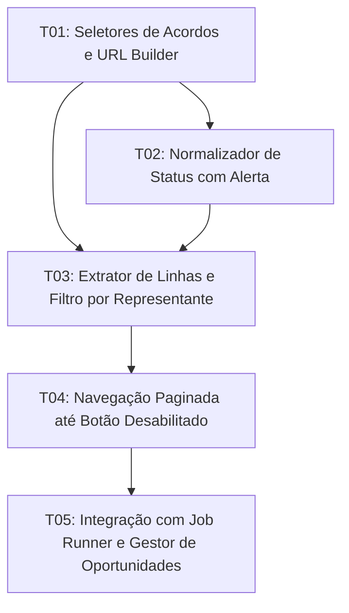

# Tasks: DocuSign Agreements Query RPA

> **Módulo**: `gestor-oportunidades-rpa-docusigner` — Consulta de acordos/envelopes via RPA DocuSign com paginação, filtro de 5 dias e detecção de status de destinatários.

## Test Coverage Matrix

> Generated from codebase, project guidelines, and spec - confirm before Execute. Guidelines found: `AGENTS.md`, `.agents/rules/global.md`, `package.json`.

| Code Layer | Required Test Type | Coverage Expectation | Location Pattern | Run Command |
| :--- | :--- | :--- | :--- | :--- |
| Selectors & URL Builder | unit | All date calculations & selector paths | `test/robot/browser/selectors.test.js` | `node --env-file=.env.dev --test test/robot/**/*.test.js` |
| Status Normalizer | unit | All 4 mapped statuses + unknown status fallback alert | `test/robot/browser/docusign.test.js` | `node --env-file=.env.dev --test test/robot/**/*.test.js` |
| Page Extractor & Pagination | integration | Table traversal, `Para:` filter, pagination termination | `test/robot/browser/docusign.test.js` | `node --env-file=.env.dev --test test/robot/**/*.test.js` |
| Job Runner Integration | integration | Action dispatch and response payload | `test/backend/modules/robot-docusign/*.test.js` | `node --env-file=.env.dev --test test/backend/**/*.test.js` |

## Gate Check Commands

```bash
npm run lint                                                    # Verificação estática de código
node --env-file=.env.dev --test test/robot/**/*.test.js         # Testes unitários e integração do robô
node --env-file=.env.dev --test test/backend/**/*.test.js       # Testes backend e controllers
node --env-file=.env.dev --test test/**/*.test.js               # Suíte completa de testes nativos
```

## Execution Plan



## Task Breakdown

### T01: Seletores de Acordos e URL Builder

- **Req**: REQ-AGR-01
- **Status**: [x] completed
- **Esforço**: 30m | Paralelável: Sim
- **Depende de**: Nenhuma
- **O quê**: Adicionar seletores da página de documentos/acordos em `robot/src/browser/selectors.js` e criar função utilitária `buildAgreementsUrl(daysBack = 5)` que calcula dinamicamente as datas `from` (hoje - 5 dias) e `to` (hoje) no formato `YYYY-MM-DD`.
- **Onde**:
  - `robot/src/browser/selectors.js`
- **Tests**: `test/robot/browser/selectors.test.js` (validar URL gerada com query params `view=agreements`, `from`, `to`, `pageSize=50`)
- **Gate**: `node --env-file=.env.dev --test test/robot/browser/selectors.test.js`
- **Commit**: `feat(robot): add agreements selectors and dynamic date url builder`

---

### T02: Normalizador de Status com Alerta

- **Req**: REQ-AGR-03, REQ-AGR-05
- **Status**: [x] completed
- **Esforço**: 45m | Paralelável: Sim
- **Depende de**: Nenhuma
- **O quê**: Implementar função pura `normalizeEnvelopeStatus(rawText)` que mapeia os status conhecidos (`Concluído` -> `completed`, `Aguardando outros`/`Aguardando` -> `waiting_others`, `Anulado` -> `voided`, `Falha na entrega` -> `delivery_failed`). Se o status for desconhecido, registrar log de aviso via `logger.warn`, emitir flag `unknown_status: true` e preservar o texto original extraído.
- **Onde**:
  - `robot/src/browser/docusign.js`
- **Tests**: `test/robot/browser/docusign.test.js` (testar os 4 status mapeados + fallback com texto customizado e alerta)
- **Gate**: `node --env-file=.env.dev --test test/robot/browser/docusign.test.js`
- **Commit**: `feat(robot): implement envelope status normalizer and unknown status alert`

---

### T03: Extrator de Linhas e Filtro por Representante

- **Req**: REQ-AGR-02
- **Status**: [x] completed
- **Esforço**: 1h | Paralelável: Não
- **Depende de**: T01, T02
- **O quê**: Implementar função `extractEnvelopesFromCurrentPage(page, repName)` que percorre todas as linhas da tabela `[data-qa="manage-envelopes-list.table"]`, lê o campo `Para:` (`[data-qa$="-mobile-from"]`), verifica se o nome do representante (limpo de acentos e maiúsculas/minúsculas) está presente e extrai os dados do envelope e status normalizado.
- **Onde**:
  - `robot/src/browser/docusign.js`
- **Tests**: `test/robot/browser/docusign.test.js` (mock de DOM Playwright com tabela de 50 linhas e verificação de extração precisa)
- **Gate**: `node --env-file=.env.dev --test test/robot/browser/docusign.test.js`
- **Commit**: `feat(robot): implement envelope row extractor and representative filter`

---

### T04: Navegação Paginada até Botão Desabilitado

- **Req**: REQ-AGR-04
- **Status**: [x] completed
- **Esforço**: 1h | Paralelável: Não
- **Depende de**: T03
- **O quê**: Implementar função `fetchAgreementsByRepresentative(page, { repName, daysBack = 5 })` que acessa a URL gerada, executa o loop de extração página a página, clica em `button[data-qa="manage-envelopes-list.footer.pagination-pagination-next"]` enquanto não estiver desabilitado (`disabled` ou classe `css-30cpj5`), aguarda o carregamento seguro da página seguinte e encerra quando a última página for atingida.
- **Onde**:
  - `robot/src/browser/docusign.js`
- **Tests**: `test/robot/browser/docusign.test.js` (testar simulação de paginação de 1, 2 e múltiplas páginas com detecção de botão desabilitado)
- **Gate**: `node --env-file=.env.dev --test test/robot/browser/docusign.test.js`
- **Commit**: `feat(robot): add paginated agreements query workflow with termination check`

---

### T05: Integração com Job Runner e Gestor de Oportunidades

- **Req**: REQ-AGR-01, REQ-AGR-02, REQ-AGR-03, REQ-AGR-04, REQ-AGR-05
- **Status**: [x] completed
- **Esforço**: 45m | Paralelável: Não
- **Depende de**: T04
- **O quê**: Integrar a ação `query_agreements` no runner de jobs (`robot/src/job-runner.js`), recebendo o parâmetro `repName` (proveniente de `id="rep-nome"` do Gestor de Oportunidades), executando a busca paginada e retornando o payload consolidado com a lista de envelopes, status e lista de alertas de status desconhecidos.
- **Onde**:
  - `robot/src/job-runner.js`
  - `backend/src/modules/robot-docusign/services/robotOrchestrator.js`
- **Tests**: `test/backend/modules/robot-docusign/robotOrchestrator.test.js`
- **Gate**: `node --env-file=.env.dev --test test/backend/**/*.test.js`
- **Commit**: `feat(robot): integrate agreements query action with job runner and orchestrator`

---

### T06: Correção de Extração de EnvelopeId e Subject no OneDS Moderno

- **Req**: REQ-AGR-06
- **Status**: [x] completed
- **Esforço**: 30m | Paralelável: Sim
- **Depende de**: T03
- **O quê**: Atualizar `agreementsService.js` e `agreements.js` para extrair o UUID do envelope diretamente de `tr[data-qa^="manage-envelopes-list.row."]` e o assunto a partir de `button[data-qa$="-mobile-name"]` e `[data-qa$="-mobile-name-text"]`, preservando os fallbacks para `href` de `<a>`.
- **Onde**:
  - `backend/src/modules/robot-docusign/browserrobot/agreementsService.js`
  - `robot/src/browser/agreements.js`
  - `backend/src/modules/robot-docusign/browserrobot/robotSelectors.js`
  - `robot/src/browser/selectors.js`
- **Tests**: `tests/robot/browser/docusign.test.js`
- **Gate**: `node --env-file=.env.dev --test tests/robot/browser/docusign.test.js`
- **Commit**: `fix(robot): extract envelopeId from row data-qa and subject from mobile button`

---

### T07: Restrição de Seleção de Linhas ao Corpo da Tabela (tbody)

- **Req**: REQ-AGR-07
- **Status**: [x] completed
- **Esforço**: 15m | Paralelável: Sim
- **Depende de**: T03, T06
- **O quê**: Ajustar `selectors.agreements.row`, `agreements.js` e `agreementsService.js` para mirar especificamente as linhas do corpo da tabela (`tbody[data-qa='manage-envelopes-list.body'] tr, tr[data-qa^='manage-envelopes-list.row.']`), evitando que a linha do cabeçalho `<thead>` seja capturada como primeiro item.
- **Onde**:
  - `robot/src/browser/selectors.js`
  - `robot/src/browser/agreements.js`
  - `backend/src/modules/robot-docusign/browserrobot/agreementsService.js`
  - `tests/robot/browser/selectors.test.js`
- **Tests**: `tests/robot/browser/selectors.test.js`
- **Gate**: `node --env-file=.env.dev --test tests/robot/browser/selectors.test.js`
- **Commit**: `fix(robot): target tbody rows to ignore header row in agreements list`


