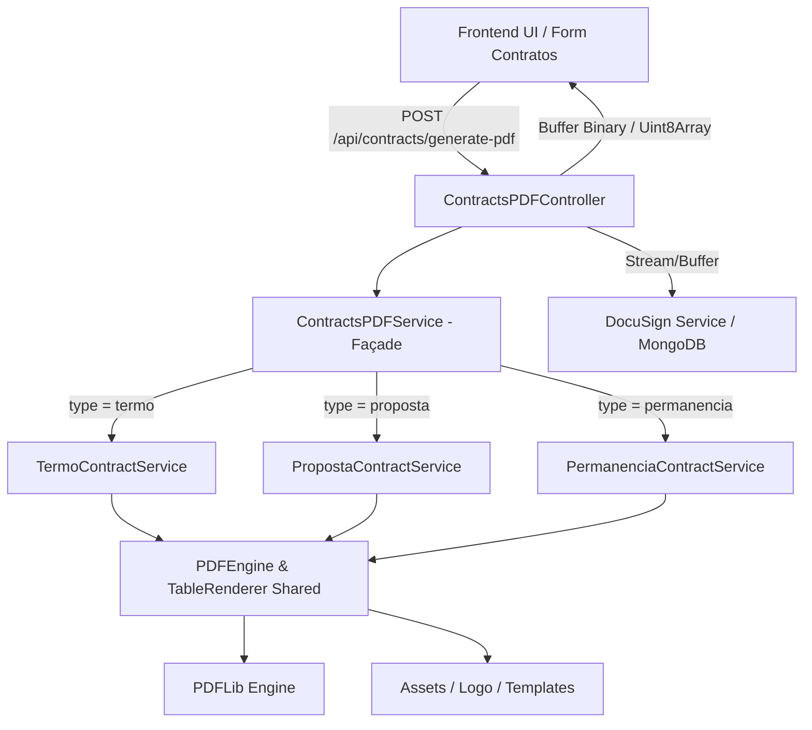

# Criador de Contratos PDF Design

**Spec**: `.specs/features/modulo-criador-contratos-pdf/spec.md`
**Status**: Approved

---

## Architecture Overview

O módulo backend `src/modules/criador-contratos-pdf/` assume a responsabilidade de gerar PDFs limpos e dinâmicos via `pdf-lib` no Node.js. O módulo adota o padrão Façade com sub-módulos isolados por tipo de contrato e um núcleo compartilhado (`shared`).

---

## Code Reuse Analysis

### Existing Components to Leverage

| Component | Location | How to Use |
| --- | --- | --- |
| `pdf-lib` package | `node_modules/pdf-lib` | Renderização nativa no servidor Node.js |
| `authMiddleware` | `src/middlewares/authMiddleware.js` | Proteção de rotas `/api/contracts/*` |
| `masks.js` / Formatação | `public/modules/contratos/masks.js` | Formatação de CPF/CNPJ/Telefone reaproveitada |

### Integration Points

| System | Integration Method |
| --- | --- |
| Express App (`src/app.js`) | Montagem de rotas sob `/api/contracts` |
| DocuSign API (`src/modules/docusign`) | Envio direto do Buffer PDF retornado pelo `ContractsPDFService` |
| MongoDB (`crm_contracts`) | Armazenamento de metadados e referência do contrato |

---

## Components & Submodules Structure

### `ContractsPDFController`

- **Purpose**: Recebe dados do formulário da requisição HTTP POST, aciona o serviço e retorna o buffer PDF.
- **Location**: `src/modules/criador-contratos-pdf/controller.js`
- **Interfaces**:
  - `generatePDF(req: Request, res: Response): Promise<void>`
- **Dependencies**: `ContractsPDFService`

### `ContractsPDFService` (Façade Router)

- **Purpose**: Orquestra e roteia as chamadas para o serviço específico conforme o tipo de contrato (`termo`, `proposta`, `permanencia`).
- **Location**: `src/modules/criador-contratos-pdf/service.js`
- **Interfaces**:
  - `generateContractPDF(type: string, data: Object): Promise<Buffer>`
  - `buildContractPDF(data: ContractData): Promise<Buffer>`
- **Dependencies**: `TermoContractService`, `PropostaContractService`, `PermanenciaContractService`

### `PDFLayoutBuilder` (Façade Layouts)

- **Purpose**: Ponto central de retrocompatibilidade para layouts.
- **Location**: `src/modules/criador-contratos-pdf/layoutBuilder.js`

### Núcleo Compartilhado (`shared/`)

- **`constants.js`**: Cores padrão TIM, dimensões de página A4 e utilitário `getFileNameBase`.
- **`pdfEngine.js`**: Utilitários para criação de documentos `PDFLib`, fontes, logo, wrap de texto e gerenciamento de cabeçalhos/títulos.
- **`tableRenderer.js`**: Renderizador genérico de tabelas com bordas para o Termo e Proposta.

### Submódulos por Tipo de Contrato (`submodules/`)

1. **Termo de Contratação (`submodules/termo/`)**
   - `termoLayout.js`: Definição de tabelas e 12 cláusulas legais do Termo v5.10.
   - `termoService.js`: Renderização exclusiva do PDF do Termo.

2. **Proposta Comercial (`submodules/proposta/`)**
   - `propostaLayout.js`: Definição de layout comercial e valores de antecipação.
   - `propostaService.js`: Renderização exclusiva do PDF da Proposta.

3. **Contrato de Permanência (`submodules/permanencia/`)**
   - `permanenciaLayout.js`: Parágrafos legais, aditivo de permanência (6 colunas) e bloco de assinaturas.
   - `permanenciaService.js`: Orquestrador que coordena as funções de renderização de cada seção.
   - `permanenciaRenderer.js`: Helpers compartilhados de paginação (`ensureSpace`) e desenho de linhas formatadas (`renderFormattedLines`).
   - `renderIntroParagraphs.js`: Renderização dos parágrafos introdutórios.
   - `renderClauses.js`: Renderização das cláusulas (com/sem título).
   - `renderAditivoTable.js`: Renderização da tabela de aditivo com cabeçalho e linhas.
   - `renderSignatures.js`: Renderização do bloco de assinaturas (representantes, TIM, testemunhas).

---

## Error Handling Strategy

| Error Scenario | Handling | User Impact |
| --- | --- | --- |
| Falha no carregamento da logo | Fallback para cabeçalho em texto limpo | O PDF é gerado sem quebra da aplicação |
| Parâmetros inválidos no body | Validação Zod com HTTP 400 | Exibe mensagem clara no formulário |
| Erro interno de renderização | Log do servidor + HTTP 500 em PT-BR | Exibe toast de erro e permite tentar novamente |

---

## Risks & Concerns

| Concern | Location | Impact | Mitigation |
| --- | --- | --- | --- |
| Tamanho excessivo de imagens de logo | `src/modules/criador-contratos-pdf/assets/` | Aumento no tamanho do PDF | Redimensionar logo para max 300px largura PNG otimizado |

---

## Tech Decisions

| Decision | Choice | Rationale |
| --- | --- | --- |
| Geração de PDF no Backend | `pdf-lib` no Node.js | Alto desempenho, sem dependências externas de binários nativos |
| Formato de Transporte | HTTP Buffer Binary (`application/pdf`) | Baixo consumo de memória e transferência rápida |
| Arquitetura Modular por Contrato | Submódulos + Façade Router | Alta coesão, desacoplamento por contrato e SOLID/SRP |
