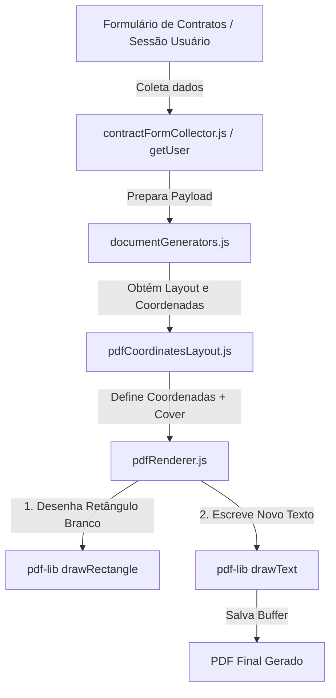

# Architecture & Design: Refactor PDF Contratos

**Spec**: `.specs/features/refactor-pdf-contratos/spec.md`  
**Status**: Approved / Implemented  

---

## 1. Contexto e Objetivos

O módulo de geração de PDF de contratos utiliza `pdf-lib` no navegador para ler templates estáticos em Base64 e desenhar sobreposições de texto.
Na Página 5 do **Contrato de Permanência**, a seção final continha dados legados da empresa antiga (*AMK PREMIUM CORP*) e da consultora antiga (*Mariana Brito*).

O objetivo deste refactor foi:
1. Ajustar as coordenadas das testemunhas e aplicar máscaras de fundo branco (`cover`).
2. Cobrir o bloco legado do rodapé da Página 5 e desenhar os dados atualizados do Senior Account (`H. B. SERVICOS DE INFORMATICA LTDA - ME 41.342.670/0001-73`).
3. Cobrir o campo do Consultor e preenchê-lo dinamicamente com as informações do usuário logado na sessão (`window.getUser()`).

---

## 2. Estrutura dos Arquivos Afetados

- **`public/modules/contratos/pdf/pdfCoordinatesLayout.js`**: Mapeador declarativo de coordenadas. Contém as definições de `getPermanenciaSpec` e `getTermoSpec`.
- **`public/modules/contratos/pdf/pdfRenderer.js`**: Motor de renderização que lê a chave `cover` e invoca `page.drawRectangle` com cor branca antes de desenhar o texto (`page.drawText`).
- **`tests/test-pdf-generation.js`**: Suite automatizada de validação dos 3 documentos (Termo, Proposta e Permanência).

---

## 3. Especificação do Mapeamento na Página 5 (Contrato de Permanência)

| Campo | Coordenada X | Coordenada Y | Largura Máscara (`cover`) | Conteúdo |
| ----- | ------------ | ------------ | ------------------------- | -------- |
| CPF Representante | 50 | 727.6 | 300 | `CPF: ${repCpf}` |
| Nome Testemunha 1 | 50 | 601.26 | 500 | `Nome Testemunha Um: ${test1Nome}` |
| CPF Testemunha 1 | 50 | 586.86 | 300 | `CPF: ${test1Cpf}` |
| Nome Testemunha 2 | 50 | 523.70 | 500 | `Nome Testemunha Dois: ${test2Nome}` |
| CPF Testemunha 2 | 50 | 509.30 | 300 | `CPF: ${test2Cpf}` |
| Senior Account | 50 | 382.96 | 520 | `TBP / Senior Account: H. B. SERVICOS DE INFORMATICA LTDA - ME` |
| CNPJ Senior Account | 50 | 368.56 | 350 | `CNPJ: 41.342.670/0001-73` |
| Consultor | 50 | 322.28 | 520 | `Consultor: ${consultorNome}` |
| CPF Consultor | 50 | 307.88 | 350 | `CPF: ${consultorCpf}` |

---

## 4. Diagrama de Fluxo

