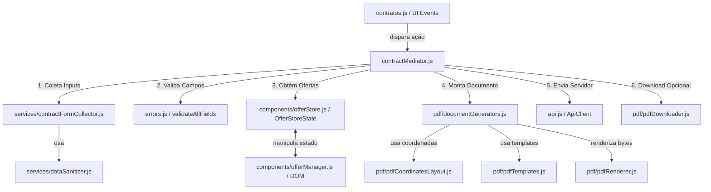

# Refatoração dos Módulos de Contratos e PDF com Princípios SOLID (design.md)

**Spec**: `.specs/features/refactor-pdf-solid/spec.md`  
**Status**: Approved  

---

## Architecture & Directory Structure Overview

O design estabelece a criação da subpasta `pdf/` sob `public/modules/contratos/`, unificando a convenção `camelCase` para código JavaScript e `kebab-case` para HTML/CSS.

### Diretório `public/modules/contratos/pdf/`

1. **`pdfTemplates.js`** (renomeado de `pdf_data.js`): Repositório puro contendo as constantes Base64 dos modelos PDF em branco (`const pdfTemplates = { ... }`).
2. **`pdfCoordinatesLayout.js`** (renomeado de `pdfLayout.js`): Mapeador com especificações explícitas de coordenadas (X/Y) para desenho via PDFLib (`getTermoSpec`, `getPropostaSpec`, `getPermanenciaSpec`).
3. **`pdfRenderer.js`**: Engine pura de desenho de baixo nível (`writeTextOnPage`) que consome `pdf-lib` e retorna `Uint8Array`.
4. **`documentGenerators.js`**: Montador de alto nível dos 3 documentos (`generateTermo`, `generateProposta`, `generatePermanencia`).
5. **`pdfDownloader.js`**: Helper I/O desacoplado responsável por disparar o download no navegador (`downloadPdfFile`).



---

## Components Specifications

### 1. Subdiretório `public/modules/contratos/pdf/`

#### `pdfTemplates.js`
- **Location**: `public/modules/contratos/pdf/pdfTemplates.js`
- **Purpose**: Armazenar templates base64 originais dos PDFs.
- **Interfaces**:
  - `window.pdfTemplates = { termoBase64: '...', propostaBase64: '...', permanenciaBase64: '...' }`

#### `pdfCoordinatesLayout.js`
- **Location**: `public/modules/contratos/pdf/pdfCoordinatesLayout.js`
- **Purpose**: Provedor das especificações de coordenadas X/Y para preenchimento de cada página.
- **Interfaces**:
  - `getTermoSpec(data: Object): Object`
  - `getPropostaSpec(data: Object): Object`
  - `getPermanenciaSpec(data: Object): Object`
  - `getFileNameBase(data: Object): string`

#### `pdfRenderer.js`
- **Location**: `public/modules/contratos/pdf/pdfRenderer.js`
- **Purpose**: Interface com a biblioteca `pdf-lib` para renderização de páginas e vetores.
- **Interfaces**:
  - `writeTextOnPage(page: Object, text: string, config: Object): void`
  - `renderDocument(base64Template: string, pagesLayout: Array): Promise<Uint8Array>`

#### `documentGenerators.js`
- **Location**: `public/modules/contratos/pdf/documentGenerators.js`
- **Purpose**: Geração compilada dos documentos em formato `Uint8Array`.
- **Interfaces**:
  - `generateTermo(data: Object): Promise<Uint8Array>`
  - `generateProposta(data: Object): Promise<Uint8Array>`
  - `generatePermanencia(data: Object): Promise<Uint8Array>`

#### `pdfDownloader.js`
- **Location**: `public/modules/contratos/pdf/pdfDownloader.js`
- **Purpose**: Disparo de I/O de download local via elemento âncora Blob no navegador.
- **Interfaces**:
  - `downloadPdfFile(bytes: Uint8Array, filename: string): void`

---

### 2. Atualizações em `public/modules/contratos/contratos.html`

Inclusão atualizada de scripts na ordem correta de dependências:

```html
<script src="https://unpkg.com/pdf-lib@1.17.1/dist/pdf-lib.min.js"></script>
<script src="/modules/contratos/pdf/pdfTemplates.js"></script>
<script src="/modules/contratos/pdf/pdfCoordinatesLayout.js"></script>
<script src="/modules/contratos/pdf/pdfRenderer.js"></script>
<script src="/modules/contratos/pdf/pdfDownloader.js"></script>
<script src="/modules/contratos/pdf/documentGenerators.js"></script>
<script src="/modules/contratos/services/dataSanitizer.js"></script>
<script src="/modules/contratos/services/contractFormCollector.js"></script>
<script src="/modules/contratos/components/offerStore.js"></script>
<script src="/modules/contratos/contractMediator.js"></script>
```

---

## Risks & Mitigation

- **Carregamento de Scripts e Dependências**: Ordem rigorosa no `contratos.html` (primeiro `pdfTemplates` e `pdfCoordinatesLayout`, seguidos de `pdfRenderer`, `pdfDownloader` e `documentGenerators`).x: `window.pdfGenerator`, `window.contractMediator`).
