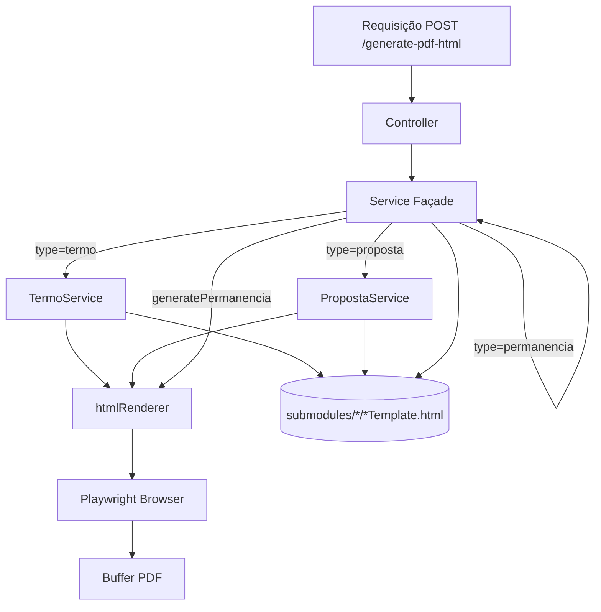

# Gerador PDF HTML — Design

**Spec**: `.specs/features/gerador-pdf-html/spec.md`
**Status**: Shipped

---

## Architecture Overview

O módulo `src/modules/gerador-pdf-html/` adota a mesma estrutura Façade + submodules do módulo existente, mas substitui a renderização com `pdf-lib` por HTML + Playwright.



---

## Code Reuse Analysis

### Existing Components to Leverage

| Components | Location | How to Use |
| --- | --- | --- |
| `*Layout.js` | `src/modules/gerador-pdf-html/submodules/termo/termoLayout.js` e `proposta/propostaLayout.js` | Layouts próprios e independentes (copiados do `criador-contratos-pdf`) — termo e proposta; permanencia não tem layout (conteúdo estático no template) |
| Playwright | `node_modules/playwright` | Runtime dep; chromium headless via `HtmlRenderer` singleton |
| Zod | `package.json` | Validação do body no controller |
| `authMiddleware` | `src/middlewares/authMiddleware.js` | Proteção da rota |
| Logo TIM | `src/modules/gerador-pdf-html/shared/logo.png` | Lida pelo `service.js` como base64 no método `generatePermanencia` |

### Integration Points

| System | Integration Method |
| --- | --- |
| Express App (`src/app.js`) | Nova rota montada em `/api/contracts/generate-pdf-html` |

---

## Components & Submodules Structure

### `htmlRenderer.js`

- **Purpose**: Singleton do Playwright. Recebe HTML string, retorna Buffer PDF.
- **Location**: `src/modules/gerador-pdf-html/htmlRenderer.js`
- **Interfaces**:
  - `render(html: string, options?: PdfOptions): Promise<Buffer>`
- **Dependencies**: `playwright` (runtime)
- **Details**:
  - Browser lançado uma vez (singleton), reusado entre chamadas
  - `page.setContent(html)` → `page.pdf({ format: 'A4', margin })`
  - Fechamento graceful via `htmlRenderer.close()`

### `controller.js`

- **Purpose**: Valida a requisição com Zod e chama o service.
- **Location**: `src/modules/gerador-pdf-html/controller.js`
- **Interfaces**:
  - `generatePDF(req, res): Promise<void>`
- **Dependencies**: ContractsPDFService (local)

### `service.js` (Façade)

- **Purpose**: Roteia para o submodule correto conforme `type`. O tipo `permanencia` é tratado inline via `generatePermanencia()`, sem service dedicado.
- **Location**: `src/modules/gerador-pdf-html/service.js`
- **Interfaces**:
  - `generateContractPDF(type, data): Promise<Buffer>`
  - `generatePermanencia(data): Promise<Buffer>` (inline, lê template + substitui `{{var}}` + render)
- **Dependencies**: TermoService, PropostaService

### Submodules (`submodules/`)

Cada submodule contém um service que:

1. Importa o layout data do próprio módulo (`getTermoLayout(data)` de `./termoLayout.js`)
2. Lê o template HTML de `tmp/test-pdfs/templates/{type}.html`
3. Substitui placeholders `{{nome}}` com os dados
4. Monta as partes repetitivas (linhas de tabela, cláusulas, assinaturas) como HTML
5. Chama `htmlRenderer.render(htmlCompleto)`

| Submodule | Layout (local) | Template |
| --- | --- | --- |
| `termo/termoService.js` | `./termoLayout.js` → `getTermoLayout(data)` | `./termoTemplate.html` |
| `proposta/propostaService.js` | `./propostaLayout.js` → `getPropostaLayout(data)` | `./propostaTemplate.html` |
| `permanencia` (inline em `service.js`) | N/A (conteúdo estático no template) | `./permanencia/permanenciaTemplate.html` |

### Templates HTML

Arquivos HTML puros. **Termo e proposta** usam CSS inline via `<style>` tag. **Permanencia** usa CSS em atributos `style=""` inline nos elementos (sem `<style>` tag), com todo o conteúdo estático (cláusulas, intro, assinaturas) hardcoded no HTML e variáveis dinâmicas como `{{var}}`.

Blocos dinâmicos (tabelas com N linhas) são montados no service e injetados via placeholder único:

```html
<!-- termo.html -->
<table>
  <tr><th>Razão Social:</th><td>{{razaoSocial}}</td></tr>
  <tr><th>CNPJ:</th><td>{{cnpj}}</td></tr>
</table>

<table>
  <tr><th>Item</th><th>Plano</th><th>Valor Mensal</th><th>Valor Chip</th></tr>
  {{tableRows}}
</table>

<div class="clauses">{{clauses}}</div>
```

### Termo — Seção 2 (DADOS DA CONTRATAÇÃO)

A seção 2 utiliza **duas tabelas separadas** com um `<div>` divisor entre elas, para garantir uma linha de borda independente que ocupe 100% da largura:

```html
<table class="section-table">
  <!-- 3 primeiros campos com vertical-align:middle -->
  <tr><td>Tipo de Contratação:</td><td style="vertical-align:middle;">{{...}}</td></tr>
  <tr><td>Data de Vencimento:</td><td style="vertical-align:middle;">{{...}}</td></tr>
  <tr><td>Tipo de Fatura:</td><td style="vertical-align:middle;">{{...}}</td></tr>
</table>
<div style="border-bottom:0.75pt solid #888;"></div>
<table class="section-table" style="margin-top:30px;">
  <!-- demais campos sem padding-top extra -->
  <tr><td>Qtd.:</td><td>{{...}}</td></tr>
  ...
</table>
```

**Motivação**: Com `border-collapse: collapse`, bordas em `<td>` ou `<tr>` não garantem alcance total à direita da seção. Separar a tabela e usar um `<div>` filho direto da `<div class="section">` elimina a interferência do layout de colapso.

---

## Error Handling Strategy

| Error Scenario | Handling | User Impact |
| --- | --- | --- |
| Template HTML não encontrado | HTTP 500 com mensagem em pt-BR | Desenvolvedor ajusta o path |
| Playwright não instalado | Log claro no startup, HTTP 503 | Operador instala chromium |
| Placeholder não substituído | Template exibe `{{...}}` literal (visível no PDF) | Desenvolvedor corrige o service |
| Dados inválidos | Zod rejeita com HTTP 400 | Frontend exibe erros de validação |

---

## Risks & Concerns

| Concern | Impact | Mitigation |
| --- | --- | --- |
| Playwright aumenta imagem Docker | +150-300MB | Usar `playwright --only-chromium`; imagem alpine com dependências mínimas |
| Browser headless consome memória | ~100MB por instância | Singleton browser; timeout de inatividade para fechar |
| CSS não corresponde ao PDF-lib atual | Diferenças visuais | Revisão manual comparando PDFs gerados pelas duas rotas |

---

## Tech Decisions

| Decision | Choice | Rationale |
| --- | --- | --- |
| Renderização HTML→PDF | Playwright (Chromium headless) | Já disponível no projeto; padrão da indústria |
| Engine de template | `string.replace` simples | Sem dependência; repetições montadas no service |
| Estrutura do módulo | Façade + submodules | Espelha o módulo existente; fácil de navegar |
| Templates junto aos services | `submodules/*/*Template.html` | Acoplamento coeso; template e lógica no mesmo pacote |
| Browser singleton | `htmlRenderer.js` com lazy init | Evita overhead de launch a cada requisição |
| Rota separada | `/api/contracts/generate-pdf-html` | Zero impacto em rotas existentes |
| Apresentação | CSS inline nos templates | Fonte única de verdade; sem props de layout mortas |
| Constantes | Inline em cada consumer (`htmlRenderer.js`, `controller.js`, `*Layout.js`) | `shared/constants.js` removido; cada arquivo declara suas próprias constantes, eliminando acoplamento desnecessário |
