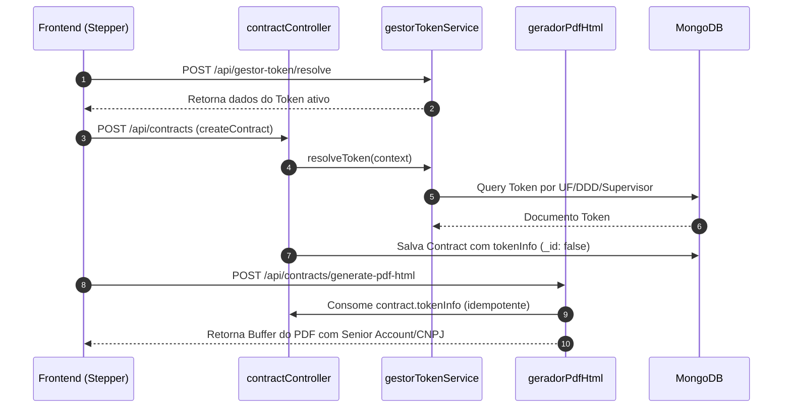

# Especificação de Design e Arquitetura — Módulo Gestor de Tokens

## 1. Arquitetura do Módulo

```
src/modules/gestor-token/
├── index.js                    # Barrel export { routes, service }
├── routes.js                   # Rotas Express protegidas por protect e ACL
├── controllers/
│   └── gestorTokenController.js# Controllers HTTP e tratamento de respostas Zod
├── services/
│   ├── gestorTokenService.js   # Lógica de negócio, CRUD e algoritmo resolveToken()
│   └── gestorTokenService.test.js # Testes unitários com mocks nativos do Node
├── schemas/
│   └── gestorTokenSchemas.js    # Schemas Zod de validação
├── config/
│   └── ufsDdds.js              # Mapeamento estático de 27 UFs e DDDs
└── models/
    └── Token.js                # Schema Mongoose da collection tokens (db_crm_funil)
```

## 2. Modelagem de Dados

### Collection `tokens` (`db_crm_funil`)
```js
{
  ufs: [{ type: String, enum: LIST_UFS }],
  ddds: [String],
  login: { type: String, required: true },
  tipoEnvio: [{ type: String, enum: ["Entrega", "Fast"] }],
  nomeTbp: String,
  cnpjTbp: String,
  supervisores: [{ type: Schema.Types.ObjectId, ref: "User" }],
  ativo: { type: Boolean, default: true },
  timestamps: true
}
```

### Extensão do Model `Contract` (`crm_contracts`)
```js
tokenInfo: {
  type: {
    tokenLogin: String,
    nomeTbp: String,
    cnpjTbp: String,
    uf: String,
    ddd: String,
    tipoEnvio: [String],
    criterioGatilho: String,
  },
  _id: false,
  default: null
}
```

## 3. Algoritmo de Resolução (`resolveToken`)

1. Lê a configuração em `SystemConfig.findOne({ key: "gestor_token" })`.
2. Avalia o parâmetro `criterio_gatilho` (`uf`, `ddd` ou `supervisor`).
3. Executa a busca em `Token` com filtro `ativo: true`:
   - Se gatilho for `"supervisor"` e `supervisorId` fornecido: busca `{ supervisores: supervisorId, ativo: true }`.
   - Se gatilho for `"ddd"` e `ddd` fornecido: busca `{ ddds: ddd, ativo: true }`.
4. Se a busca específica não encontrar resultado, executa fallback para `{ ufs: context.uf, ativo: true }`.
5. Retorna `{ token, criterioGatilho }` ou `null`.

## 4. Integração nos Fluxos do Sistema


