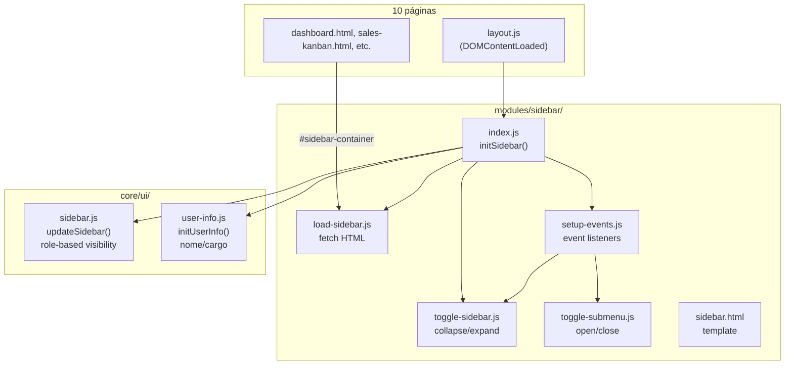

# Sidebar — Design

**Spec**: `.specs/features/sidebar/spec.md`
**Status**: Implementado e em produção

---

## Architecture Overview

A sidebar é um módulo frontend vanilla (sem framework) que segue o padrão de **componente autônomo com injeção de HTML**. O HTML é servido estaticamente e injetado via `fetch()` no container `#sidebar-container`. A lógica é dividida em 7 arquivos dentro de `public/modules/sidebar/` mais 2 helpers core em `public/js/core/ui/`. A sidebar é consumida por 10 páginas no total.



### Fluxo de Inicialização

```
DOMContentLoaded
  └→ initSidebar()
       ├─ 1. loadSidebar()        → fetch("modules/sidebar/sidebar.html") → #sidebar-container.innerHTML
       ├─ 2. restoreSidebarState() → localStorage → .collapsed toggle
       ├─ 3. highlightActiveLink() → window.location → .nav-link.active
       ├─ 4. updateSidebar()      → App.getUser().cargo → display:none por role
       ├─ 5. initUserInfo()       → App.getUser().nome/cargo → #userName, #userRole, #userInitial
       └─ 6. setupEvents()        → addEventListener: toggle, submenu, logout
```

---

## Code Reuse Analysis

### Existing Components to Leverage

| Component | Location | How It's Used |
|-----------|----------|---------------|
| `App.getUser()` | Global (`App` object) | Retorna `{ _id, nome, cargo, ... }` para role-based visibility |
| `App.clearSession()` | Global (`App` object) | Logout: limpa sessão e redireciona |
| `#sidebar-container` | Todas as 11 páginas | Container onde o HTML é injetado |
| `.dashboard-layout` | CSS grid layout | Classe pai que controla o grid; `.collapsed` modifica o layout |
| `localStorage` | Web API nativa | Persiste estado collapsed entre sessões |
| Phosphor Icons | CDN (`@phosphor-icons/web`) | Ícones na navegação |

### No new dependencies

Zero dependências adicionais. Tudo é:
- HTML vanilla
- CSS puro (variáveis CSS custom properties)
- JavaScript ES6 modules (sem bundler)
- Phosphor Icons (já existente no projeto)

---

## Components

### `public/modules/sidebar/sidebar.html`
- **Purpose**: Template da sidebar
- **Estrutura**: `<aside class="sidebar">` → `.logo` (menu-toggle + ícone + span) → `.nav-menu` (5 grupos expansíveis: Indicadores & Relatórios, Vendas & Operação, Gestão Comercial, Administração de Pessoas, Configurações Técnicas) → `.user-profile` (avatar + nome + role + logout)
- **Role-gated items**: subitens com `display: none` por cargo — grupos ocultados automaticamente quando todos os subitens são ocultos
- **Grupos**: 5 categorias com `data-toggle="submenu"`, cada uma com subitens organizados por domínio

### `public/modules/sidebar/index.js`
- **Purpose**: Orquestrador do módulo
- **Exports**: `initSidebar()` — async, chamado via `DOMContentLoaded` (layout.js) ou import direto
- **Internal**: `highlightActiveLink()` — sincrono, varre `.nav-link` e compara `href` com pathname
- **Dependencies**: Importa 4 módulos + 2 core helpers

### `public/modules/sidebar/load-sidebar.js`
- **Purpose**: Fetch + injeção do HTML
- **Interface**: `loadSidebar()` → `Promise<void>`
- **Error handling**: try/catch → console.error + fallback HTML
- **Guard**: Early return se `#sidebar-container` não existe

### `public/modules/sidebar/setup-events.js`
- **Purpose**: Anexa event listeners após o HTML estar no DOM
- **Interfaces**: `setupEvents()` — 3 bindings:
  1. `.menu-toggle` click → `toggleSidebar()`
  2. `[data-toggle="submenu"]` click → `toggleSubmenu(trigger, targetId)`
  3. `#sidebarLogoutBtn` click → `window.App.clearSession()`
- **Padrão**: `addEventListener` (não inline `onclick`) — consistente com AD-010

### `public/modules/sidebar/toggle-sidebar.js`
- **Purpose**: Controle de collapsed mode
- **Interfaces**:
  - `toggleSidebar()` — alterna `.collapsed` no `.dashboard-layout`, persiste em `localStorage`
  - `restoreSidebarState()` — lê `localStorage`, aplica `.collapsed` se `"true"`
- **Storage key**: `"sidebarCollapsed"` (string `"true"` / `"false"`)

### `public/modules/sidebar/toggle-submenu.js`
- **Purpose**: Expansão de submenu
- **Interface**: `toggleSubmenu(triggerElement, submenuId)` — alterna `.open` no submenu e no `.nav-item` pai

### `public/modules/sidebar/sidebar.css`
- **Purpose**: Estilos completos da sidebar
- **Responsabilidades**:
  - Layout base (flex column, 100vh)
  - Nav-links com hover/active states
  - Submenu com `max-height` animado (0 → 500px)
  - Collapsed mode (60px width, textos ocultos, ícones centralizados)
  - Floating submenu em collapsed mode (`position: absolute; left: 100%`)
  - Responsivo mobile (≤768px: hidden por padrão, fixed 32px quando collapsed)
- **Variáveis**: Usa CSS custom properties do tema (`--surface-dark`, `--border-color`, `--primary-color`, etc.)

### `public/js/core/ui/sidebar.js`
- **Purpose**: Role-based visibility
- **Interface**: `updateSidebar()` — sem parâmetros, lê `App.getUser()`
- **Visibility matrix**:

| Item / ID | vendedor | supervisor | coordenador | admin | suporte |
|-----------|----------|------------|-------------|-------|---------|
| **Grupo: Indicadores & Relatórios** (navGroupIndicadores) | ✓ | ✓ | ✓ | ✓ | ✓ |
| Funil de Vendas (navDashboardItem) | ✓ | ✓ | ✓ | ✓ | ✓ |
| Relatório Pós SMB (navReportItem) | - | ✓ | ✓ | ✓ | ✓ |
| **Grupo: Vendas & Operação** (navGroupVendas) | ✓ | ✓ | ✓ | ✓ | ✓ |
| Pipeline (navPipeline) | ✓ | ✓ | ✓ | ✓ | ✓ |
| Contratos (navContracts) | ✓ | ✓ | ✓ | ✓ | ✓ |
| **Grupo: Gestão Comercial** (navGroupGestaoComercial) | - | - | - | ✓ | ✓ |
| Metas (navGoals) | - | - | - | ✓ | ✓ |
| Campanhas (navCampaigns) | - | - | - | ✓ | ✓ |
| **Grupo: Administração de Pessoas** (navGroupAdminPessoas) | - | ✓ | ✓ | ✓ | ✓ |
| Minha Equipe (navTeam) | - | ✓ | ✓ | ✓ | ✓ |
| Usuários (adminLink) | - | - | - | ✓ | ✓ |
| Controle de Acessos (navAclItem) | - | - | - | ✓ | - |
| **Grupo: Configurações Técnicas** (navGroupConfigTecnicas) | - | - | - | ✓ | ✓ |
| Tabela de Preços (navTabelaPrecos) | - | - | - | ✓ | ✓ |
| Perfis de Importação (navImportProfiles) | - | - | - | ✓ | ✓ |
| Configuração do Sistema (navSystemConfig) | - | - | - | ✓ | - |
| Gestor de Tokens (navGestorToken) | - | - | - | ✓ | ✓ |

- **Fallback**: Cargo não mapeado → vendedor scope (dashboard + pipeline)

### `public/js/core/ui/user-info.js`
- **Purpose**: Preenche dados do usuário no footer
- **Interface**: `initUserInfo()` — lê `App.getUser()`, seta `innerText` de `#userName`, `#userRole`, `#userInitial`

---

## Data Flow

### Init Sequence (típica)

```
Página                          Browser                    Servidor
  │                               │                          │
  ├─ <script type="module"> ──────┤                          │
  │                               │                          │
  ├─ import { initSidebar } ──────┤                          │
  │                               │                          │
  ├─ DOMContentLoaded ────────────┤                          │
  │                               ├─ initSidebar()           │
  │                               │  ├─ fetch(HTML) ─────────┤─── GET /modules/sidebar/sidebar.html
  │                               │  │  ← HTML ─────────────┤─── 200 OK
  │                               │  ├─ restoreSidebarState()│
  │                               │  ├─ highlightActiveLink()│
  │                               │  ├─ updateSidebar()      │
  │                               │  │  └─ App.getUser()     │
  │                               │  ├─ initUserInfo()       │
  │                               │  │  └─ App.getUser()     │
  │                               │  └─ setupEvents()        │
  │                               │                          │
```

### Collapsed Toggle

```
clique .menu-toggle
  └→ toggleSidebar()
       ├─ layout.classList.toggle("collapsed")
       ├─ localStorage.setItem("sidebarCollapsed", bool)
       └→ CSS: .dashboard-layout.collapsed .sidebar → width: 60px, textos ocultos
```

### Visual States

| State | Sidebar width | Itens | Submenu |
|-------|---------------|-------|---------|
| Expanded (desktop) | ~250px (default) | Ícone + texto | Abaixo, animado |
| Collapsed (desktop) | 60px | Apenas ícone | Floating à direita |
| Mobile (≤768px) | `display: none` | - | - |
| Mobile collapsed | 32px fixed | Apenas ícone | Floating à direita |

---

## Error Handling Strategy

| Error Scenario | Handling | User Impact |
|----------------|----------|-------------|
| Fetch sidebar.html falha (404/500/rede) | `loadSidebar()` catch → `container.innerHTML = "Falha ao carregar menu"` | Sidebar não carrega; mensagem de erro visível |
| `#sidebar-container` ausente | Early return em `loadSidebar()` | Nada acontece (página sem sidebar) |
| `App.getUser()` retorna null | `updateSidebar()` early return (`if (!user) return`) | Sidebar carrega sem role filtering; todos os itens que não têm `display:none` inline ficam visíveis |
| Cargo não encontrado nas regras | Fallback para `["navDashboardItem"]` (dentro de navGroupIndicadores) | Usuário vê só Dashboard |
| `window.App` ou `clearSession` inexistente | Guard `if (window.App && window.App.clearSession)` | Botão de logout simplesmente não funciona |
| `localStorage` indisponível | `restoreSidebarState()` → `isCollapsed` = null → estado expandido padrão | Sidebar sempre expandida; toggle não persiste |

---

## Risks & Concerns

| Concern | Location | Impact | Mitigation |
|---------|----------|--------|------------|
| Fetch blocking: sidebar carrega depois do conteúdo | `load-sidebar.js` | Conteúdo principal pode renderizar antes da navegação | Aceitável para UX; sidebar não é crítica para o conteúdo principal |
| Ícones Phosphor dependem de CDN | `sidebar.html` (via head global) | Se CDN cair, ícones não aparecem | CDN confiável (unpkg); fallback visual via CSS (texto sem ícone ainda é legível) |
| `innerHTML` no `loadSidebar` | `load-sidebar.js:13` | XSS se HTML injetado contiver script | HTML é arquivo estático do próprio projeto (mesma origem) — sem risco |
| Duplicação de event listeners | `setup-events.js` | Se `initSidebar()` for chamado múltiplas vezes, listeners se acumulam | `addEventListener` sem `removeEventListener` — potencial vazamento; mitigado porque `initSidebar()` é chamado uma vez por página |
| 60px collapsed pode ser estreito demais | `sidebar.css:164` | Ícones podem ficar apertados | Testado e validado; mobile tem 32px — 60px é folgado em comparação |

---

## Tech Decisions

| Decision | Choice | Rationale |
|----------|--------|-----------|
| HTML injection via fetch | `loadSidebar()` com `innerHTML` | Evita duplicar o HTML da sidebar em 11 páginas; uma fonte única |
| 7 arquivos separados | Cada responsabilidade em um arquivo | Coesão alta, acoplamento baixo; facilitaria migração para bundler futuro |
| CSS transitions para submenu | `max-height: 0 → 500px` | Animação nativa, sem JS; `max-height` trick é padrão para altura desconhecida |
| localStorage para collapsed state | `sidebarCollapsed: "true"/"false"` | Persistência simples, sem backend; funciona offline |
| Role visibility via JS (não CSS) | `element.style.display = "none"` | Dinâmico; depende do usuário logado, não de build-time |
| Floating submenu em collapsed | `position: absolute; left: 100%` | Aproveita o espaço horizontal à direita da sidebar estreita |
| Phosphor Icons via CDN | `<script src="https://unpkg.com/@phosphor-icons/web">` | Já existente no projeto; sem build step; 7000+ ícones |
| `addEventListener` (não `onclick`) | `setup-events.js` | Consistente com AD-010: módulos ES6 não exportam para window |
| Fallback para vendedor | `visibilityRules` default | Mínimo acesso funcional se cargo não reconhecido |

---

## Integration Points

| Page | Init method | Notas |
|------|-------------|-------|
| `dashboard.html` | `dashboard.js` → import direto `initSidebar()` | Chama `await initSidebar()` na linha 211 |
| `sales-kanban.html` | `layout.js` → DOMContentLoaded | Inicialização automática |
| `contratos.html` | `layout.js` → DOMContentLoaded | Inicialização automática |
| `team.html` | `layout.js` → DOMContentLoaded | Padrão |
| `admin-users.html` | `layout.js` → DOMContentLoaded | Padrão |
| `admin-goals.html` | `layout.js` → DOMContentLoaded | Padrão |
| `admin-campaigns.html` | `layout.js` → DOMContentLoaded | Padrão |
| `modules/produtos-precos/tabela-precos.html` | `layout.js` → DOMContentLoaded | Padrão |
| `import-profiles.html` | `import-profiles.js` → import direto `initSidebar()` | Chama `await initSidebar()` na linha 20 |
| `relatorio_pos_smb.html` | `relatorio-pos-smb/index.js` → import direto `initSidebar()` | Chama `await initSidebar()` na linha 24 |

---

## Project-Level Decisions (for STATE.md)

Nenhuma decisão nova necessária. O sidebar segue padrões já estabelecidos:

- **AD-010** (addEventListener sobre onclick) já está documentado e é seguido
- **Módulos ES6** com `type="module"` é o padrão do projeto
- **Carregamento assíncrono** de HTML é padrão no frontend (sem bundler, sem SSR)
