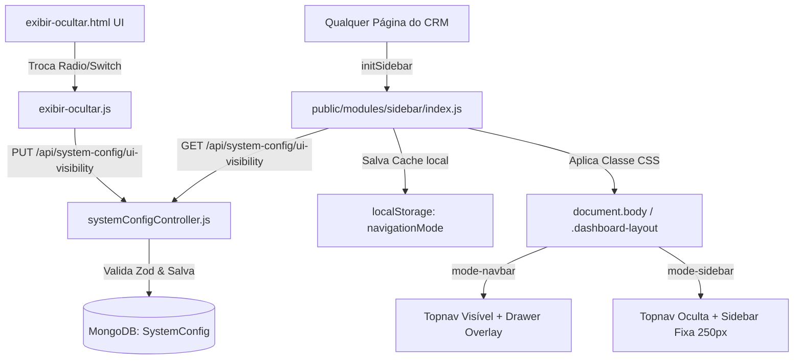

# Seletor de Modo de Navegação & Ajustes de Hambúrguer — Architecture & Design

## Visão Geral

Este documento descreve a arquitetura técnica para habilitar a alternância dinâmica entre **Modo Navbar** (Topnav + Drawer) e **Modo Sidebar** (Menu lateral fixo de 250px), além do ajuste de layout do hambúrguer no Topnav.

## Arquitetura de Componentes & Fluxo de Dados



## Detalhamento das Alterações

### 1. HTML (`sidebar.html` & `exibir-ocultar.html`)

- `public/modules/sidebar/sidebar.html`:
  - Garantir a ordem dos elementos no `<header class="topnav">`:
    ```html
    <header class="topnav">
      <button type="button" class="menu-toggle" aria-label="Alternar menu" aria-expanded="false">
        <i class="ph ph-list"></i>
      </button>
      <div class="topnav-brand">
        <i class="ph ph-funnel"></i>
        <span>CRM Funil</span>
      </div>
    </header>
    ```

- `public/modules/config-sistema/exibir-ocultar/exibir-ocultar.html`:
  - Adicionar nova linha no container `.multi-toggle`:
    ```html
    <div class="toggle-item-row">
      <div class="toggle-info">
        <span class="field-label">Modo de Navegação Principal</span>
        <span class="field-description">Escolha entre a barra superior com gaveta (Navbar) ou o menu lateral fixo (Sidebar).</span>
      </div>
      <div class="nav-mode-selector">
        <label class="radio-label">
          <input type="radio" name="navigation_mode" value="navbar" checked />
          <span>Navbar (Topo + Gaveta)</span>
        </label>
        <label class="radio-label">
          <input type="radio" name="navigation_mode" value="sidebar" />
          <span>Sidebar (Lateral Fixa)</span>
        </label>
      </div>
    </div>
    ```

### 2. Estilos CSS (`sidebar.css`)

- Ocultar o hambúrguer interno da sidebar quando o modo for Navbar ou quando a gaveta abrir:
  ```css
  .sidebar .logo .menu-toggle {
    display: none !important;
  }
  ```
- Suporte aos dois modos via classe container `.mode-sidebar` e `.mode-navbar`:
  - `.mode-sidebar`: `.topnav` tem `display: none !important`, `.dashboard-layout` tem `grid-template-columns: 250px 1fr !important`, e `.sidebar` tem `position: sticky; transform: none !important`.
  - `.mode-navbar`: `.topnav` tem `display: flex !important`, `.dashboard-layout` tem `display: block !important; padding-top: 60px`, e `.sidebar` atua como `position: fixed` drawer overlay.

### 3. Frontend JS (`index.js` & `exibir-ocultar.js`)

- `public/modules/sidebar/index.js`:
  - No `initSidebar()`, ler `localStorage.getItem("navigationMode")` para aplicar o modo instantaneamente (evitando FOUC).
  - Em segundo plano, consultar `GET /api/system-config/ui-visibility` e atualizar a classe no DOM + cache.

- `public/modules/config-sistema/exibir-ocultar/exibir-ocultar.js`:
  - Carregar o estado inicial de `navigation_mode` na inicialização da página.
  - Adicionar listener nos rádios de `navigation_mode` para enviar o PUT e atualizar a classe imediatamente.

### 4. Backend (`systemConfigController.js`)

- Atualizar o schema Zod e valores padrão:
  ```js
  const uiVisibilitySchema = z.object({
    contracts_section: z.boolean().optional(),
    watermark_enabled: z.boolean().optional(),
    navigation_mode: z.enum(["navbar", "sidebar"]).optional(),
  });
  ```
- Atualizar valor padrão inicial para conter `navigation_mode: "navbar"`.

---

## Componentes Legados Preservados (Intocáveis)

- Assinaturas de rotas de autenticação e controllers de pipeline.
- Estrutura de papéis e regras de visibilidade em `public/js/core/ui/sidebar.js`.
- Elementos com IDs legados `nav-*`.
