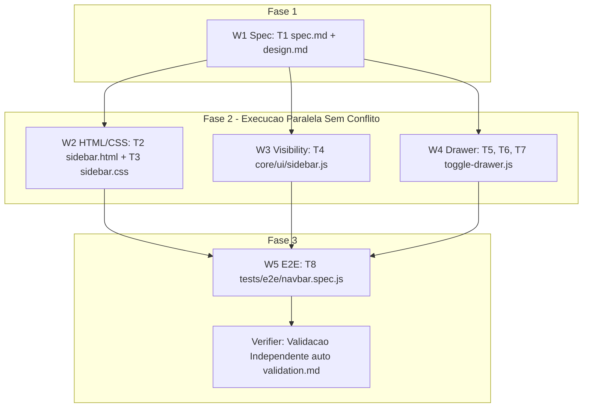

# Topnav & Drawer Sidebar — Architecture & Design

## Overview

O sub-módulo **Topnav & Drawer** complementa a arquitetura de UI global do CRM Funil de Vendas. Ele estende o componente da Sidebar sem alterar as interfaces públicas ou quebrar os seletores DOM consumidos pelas 10 páginas da aplicação.

## Arquitetura de Componentes & Isolamento de Sub-Agentes

Para garantir execução paralela sem conflito de merge de código (zero overlap de arquivos editados), as tarefas da Fase 2 são rigorosamente separadas por responsabilidade de arquivos:

## Divisão de Módulos & Arquivos (Workers W1..W5)

| Worker | Tarefas | Arquivos Exclusivos Afetados | Dependências |
| ------ | ------- | ---------------------------- | ------------ |
| **W1 Spec** | T1 | `.specs/features/componentes-globais-ui/sidebar/sub-specs/topnav-drawer/{spec,design,tasks}.md` | Nenhum |
| **W2 HTML+CSS** | T2, T3 | `public/modules/sidebar/sidebar.html`, `public/modules/sidebar/sidebar.css` | T1 |
| **W3 Visibility** | T4 | `public/js/core/ui/sidebar.js` | T1 |
| **W4 Drawer** | T5, T6, T7 | `public/modules/sidebar/toggle-drawer.js`, `public/modules/sidebar/index.js` | T1 |
| **W5 E2E** | T8 | `tests/e2e/navbar.spec.js` | T2, T3, T4, T6, T7 |

## Princípios SOLID & PonyTail Aplicados

1. **Single Responsibility Principle (SRP)**:
   - `toggle-drawer.js`: Responsável exclusivamente pelo gerenciamento de eventos, classes e estados ARIA do Drawer.
   - `core/ui/sidebar.js`: Mantém foco único na visibilidade role-based.
2. **Open/Closed Principle (OCP)**:
   - A extensão do Drawer não altera a estrutura dos seletores `nav-*` existentes, permitindo novos itens sem quebrar código antigo.
3. **PonyTail Alignment**:
   - Zero sobre-engenharia: Sem frameworks externos (ex: Bootstrap/Tailwind), mantendo JavaScript Vanilla modular e Vanilla CSS com custom properties.

## Componentes Legados Protegidos (Intocáveis)

- Backend (`src/**`)
- Estrutura HTML das 10 páginas principais (`public/*.html`)
- IDs de navegação `nav-*` (`navGroupIndicadores`, `navGroupVendas`, `navGroupGestaoComercial`, `navGroupAdminPessoas`, `navGroupConfigTecnicas`, `navPipeline`, `navContracts`, etc.)
- Elemento contêiner `#sidebar-container`
- Métodos e scripts de usuário (`App.getUser()`, `public/js/core/ui/user-info.js`)
