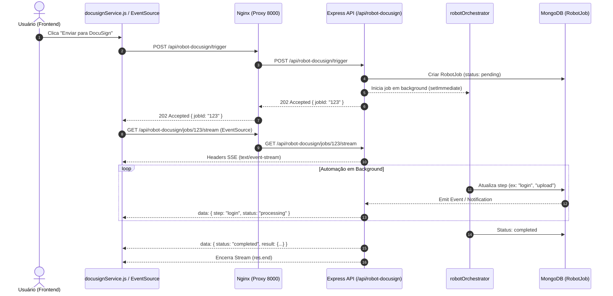

# Sub-Spec: Robot-DocuSigner — Disparo Assíncrono (Job Pattern) + Stream de Progresso (SSE)

## Visão Geral

Atualmente, o disparo do robô DocuSign via `POST /api/robot-docusign/trigger` é executado de forma síncrona, fazendo com que a requisição HTTP aguarde toda a automação do Playwright (login, navegação, upload de PDF, preenchimento e assinatura). Esse processo excede frequentemente o timeout de 60 segundos do Nginx, gerando erro **504 (Gateway Time-out)**.

Esta sub-especificação define a migração da arquitetura para **Disparo Assíncrono (Job Pattern)** combinado com **Server-Sent Events (SSE)** para streaming de progresso em tempo real e **Polling Fallback** no frontend.

---

## Requisitos Funcionais

### REQ-ASYNC-01: Disparo Assíncrono (HTTP 202 Accepted)
- **WHEN** o cliente fizer um `POST /api/robot-docusign/trigger` ou `POST /api/robot-docusign/trigger-batch`
- **THEN** o controller DEVE criar o registro em `RobotJob` com status `pending`
- **THEN** iniciar o processamento em background (assíncrono) sem bloquear a resposta HTTP
- **THEN** responder imediatamente com status `202 Accepted` contendo `{ success: true, message: "Job agendado", jobId: job._id, status: "pending" }`

### REQ-ASYNC-02: Endpoint de Stream de Progresso (SSE)
- **WHEN** o cliente acessar `GET /api/robot-docusign/jobs/:jobId/stream` com cabeçalhos SSE
- **THEN** a resposta DEVE definir `Content-Type: text/event-stream`, `Cache-Control: no-cache` e `Connection: keep-alive`
- **THEN** transmitir eventos SSE (`data: JSON.stringify(stepInfo)`) a cada alteração de status/step do `RobotJob`
- **THEN** enviar pings de keep-alive (`: ping\n\n`) a cada 15 segundos para evitar timeout de inatividade do Nginx
- **THEN** ao atingir status terminal (`completed` ou `failed`), transmitir o evento final e encerrar a conexão com `res.end()`

### REQ-ASYNC-03: Atualização do Cliente Frontend (api.js / docusignService.js)
- **WHEN** o usuário acionar o envio de contrato para o DocuSign no frontend
- **THEN** a chamada `window.api.triggerRobot` DEVE receber a resposta `202 Accepted` e o `jobId`
- **THEN** conectar um `EventSource` a `/api/robot-docusign/jobs/:jobId/stream` exibindo feedback dinâmico no modal ("Efetuando login...", "Enviando PDF...", "Concluído!")
- **THEN** fechar o modal ou exibir mensagem de sucesso/erro conforme o resultado do stream

### REQ-ASYNC-04: Polling Fallback
- **WHEN** o navegador não suportar `EventSource` ou se a conexão SSE falhar/cair prematuramente
- **THEN** o frontend DEVE realizar polling automático a cada 3 segundos no endpoint `GET /api/robot-docusign/status/:jobId` até obter status `completed` ou `failed`

### REQ-ASYNC-05: Configuração do Proxy Nginx para SSE
- **WHEN** a rota `/api/robot-docusign/jobs/.*/stream` for requisitada no Nginx
- **THEN** o Nginx DEVE desativar o buffering (`proxy_buffering off;`) e estender o timeout de leitura (`proxy_read_timeout 3600s;`) para manter o streaming de eventos fluido.

---

## Arquitetura & Fluxo de Dados



---

## Estrutura de Eventos SSE

Os pacotes de evento transmitidos pela rota SSE possuem o seguinte formato JSON:

```json
{
  "jobId": "66bc1234567890abcdef1234",
  "status": "processing",
  "step": {
    "name": "login",
    "status": "success",
    "message": "Autenticado na DocuSign com sucesso",
    "timestamp": "2026-08-12T17:20:00.000Z"
  },
  "progress": 50,
  "error": null
}
```

Ao finalizar:
```json
{
  "jobId": "66bc1234567890abcdef1234",
  "status": "completed",
  "result": { "envelopeId": "env-123456" },
  "progress": 100,
  "error": null
}
```

---

## Impact Protector & Limites de Escopo

- **Onde irá mudar:**
  1. `src/modules/robot-docusign/controllers/robotDocusignController.js` (retornar 202 no `trigger` e adicionar endpoint `streamJobProgress`).
  2. `src/modules/robot-docusign/services/robotOrchestrator.js` (adicionar `EventEmitter` para emitir eventos de avanço de step).
  3. `src/modules/robot-docusign/routes.js` (adicionar rota `GET /jobs/:jobId/stream`).
  4. `public/modules/contratos/api.js` e `public/modules/contratos/services/docusignService.js` (suporte a resposta 202 e escuta SSE com polling fallback).
  5. `nginx/default.conf` (suporte a `proxy_buffering off;` no endpoint de stream).

- **O que acontece após a mudança:**
  1. A requisição de envio de contratos responde instantaneamente ao cliente (< 100ms), eliminando completamente erros HTTP 504.
  2. O modal do frontend exibe progresso ao vivo dos passos do robô.
  3. Seletores DOM, permissões ACL, tabelas de banco e regras de negócio legadas de contratos permanecem 100% intactas.
