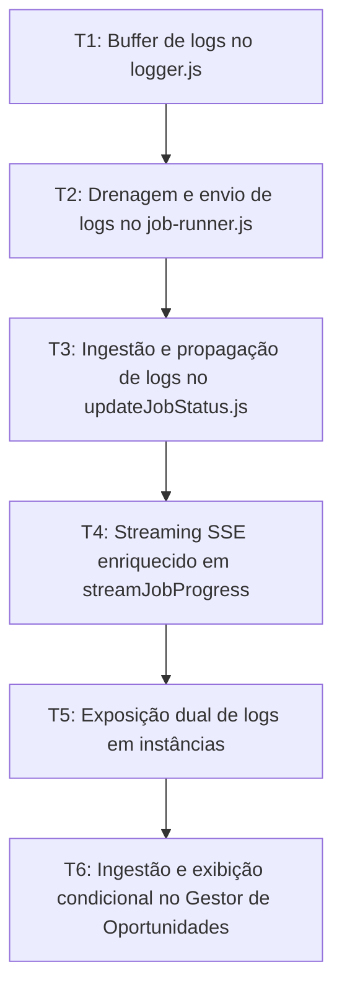

# Tasks: Transmissão de Logs SSE na Íntegra (Robô -> Servidor -> Gestor de Oportunidades)

## Contexto e Relação com Specs do Gestor de Oportunidades
As tarefas abaixo complementam e implementam os contratos definidos nas seguintes especificações do repositório `gestor-oportunidades`:
- [`gestor-oportunidades/.specs/features/robot-docusigner/SPEC.md`](file:///C:/www/producao/servidor-unity-rce/gestor-oportunidades/.specs/features/robot-docusigner/SPEC.md)
- [`gestor-oportunidades/.specs/features/robot-docusigner/sub-specs/telemetry-idle-logs/spec.md`](file:///C:/www/producao/servidor-unity-rce/gestor-oportunidades/.specs/features/robot-docusigner/sub-specs/telemetry-idle-logs/spec.md)
- [`gestor-oportunidades/.specs/features/robot-docusigner/sub-specs/logs-solid-refactor/spec.md`](file:///C:/www/producao/servidor-unity-rce/gestor-oportunidades/.specs/features/robot-docusigner/sub-specs/logs-solid-refactor/spec.md)
- [`gestor-oportunidades/.specs/features/config-sistema/sub-specs/robot-docusign/spec.md`](file:///C:/www/producao/servidor-unity-rce/gestor-oportunidades/.specs/features/config-sistema/sub-specs/robot-docusign/spec.md)

---

## Test Coverage Matrix

| Requirement ID | Task | Test Type | Test File | Gate |
|---|---|---|---|---|
| LOG-01 | T1 | Regression | `tests/robot/logger-buffer.test.js` | Logger acumula e drena mensagens ordenadas com timestamp e tag |
| LOG-02 | T2 | Regression | `tests/robot/job-runner-logs.test.js` | JobRunner anexa logs drenados no PATCH de status do job |
| LOG-03 | T3 | Regression | `tests/backend/controllers/updateJobStatus-logs.test.js` | Handler updateJobStatus propaga logs para o evento job:progress |
| LOG-04 | T4 | Regression | `tests/backend/controllers/streamJobProgress.test.js` | Stream SSE envia logs em tempo real e emite evento done ao concluir |
| LOG-05 | T5 | Regression | `tests/backend/controllers/robotInstance-telemetry.test.js` | Endpoints de instâncias expõem simultaneamente logs e telemetryLogs |
| LOG-06 | T6 | Regression | `gestor-oportunidades/tests/frontend/terminal-logs.test.js` | Terminal renderiza logs brutos no modo Na Íntegra e cards no Resumo |

## Gate Check Commands

```bash
# Validação do Robô Standalone
npm run test:robot

# Validação do Servidor Backend
npm run test:backend

# Validação de Integridade do Inventário de Rotas
make routes-inventory-check
```

## Execution Plan



## Task Breakdown

### T1: Buffer de logs no logger.js
*Depends on*: none
*Where*: `robot/src/utils/logger.js`
*Tests*: `tests/robot/logger-buffer.test.js`
*Gate*: `npm run test:robot`
- [x] Implementar buffer de mensagens em memória (`jobLogsBuffer = []`) no `logger.js`.
- [x] Exportar métodos `drainJobLogs()` e `clearJobLogs()`.
- [x] Capturar mensagens formatadas em `step`, `success`, `error`, `warn` e `info`.

### T2: Drenagem e envio de logs no job-runner.js
*Depends on*: T1
*Where*: `robot/src/job-runner.js`
*Tests*: `tests/robot/job-runner-logs.test.js`
*Gate*: `npm run test:robot`
- [x] Limpar o buffer de logs ao iniciar o processamento de cada job.
- [x] Drenar os logs acumulados e anexar o array `logs` em cada chamada de `this.api.updateJobStatus(jobId, statusPayload)`.
- [x] Atualizar `robot/src/api-client.js` para enviar o campo `logs` no corpo do PATCH HTTP.

### T3: Ingestão e propagação de logs no updateJobStatus.js
*Depends on*: T2
*Where*: `backend/src/modules/robot-docusign/controllers/instance/updateJobStatus.js`
*Tests*: `tests/backend/controllers/updateJobStatus-logs.test.js`
*Gate*: `npm run test:backend`
- [x] Adicionar campo opcional `logs: z.array(z.string()).optional()` no `updateStatusSchema`.
- [x] Propagar o array `logs` no payload do evento `robotEvents.emit("job:progress", { jobId, status, steps, result, error, logs })`.

### T4: Streaming SSE enriquecido em streamJobProgress
*Depends on*: T3
*Where*: `backend/src/modules/robot-docusign/controllers/robotDocusignController.js`
*Tests*: `tests/backend/controllers/streamJobProgress.test.js`
*Gate*: `npm run test:backend`
- [x] Repassar `logs: progressData.logs || []` nos chunks de dados SSE.
- [x] Emitir o evento nomeado `event: done\ndata: {}\n\n` antes de fechar a resposta com `res.end()`.

### T5: Exposição dual de logs em instâncias
*Depends on*: T4
*Where*: `backend/src/modules/robot-docusign/controllers/instance/getAllInstances.js`
*Tests*: `tests/backend/controllers/robotInstance-telemetry.test.js`
*Gate*: `npm run test:backend`
- [x] Expor simultaneamente as chaves `logs` e `telemetryLogs` em `getAllInstances.js` e `getInstanceTelemetry.js`.

### T6: Ingestão e exibição condicional no Gestor de Oportunidades
*Depends on*: T5
*Where*: `C:/www/producao/servidor-unity-rce/gestor-oportunidades/public/modules/config-sistema/robot-docusign/js/monitoramento/instanceTelemetry.js`
*Tests*: `gestor-oportunidades/tests/frontend/terminal-logs.test.js`
*Gate*: `make routes-inventory-check`
- [x] Atualizar `fetchInstances()` com `?includeLogs=true` em `robotDocusignApi.js`.
- [x] Aceitar `inst.logs || inst.telemetryLogs` em `instanceTelemetry.js`.
- [x] Renderizar logs brutos quando o botão "Na Íntegra" (Raw) estiver ativo, mantendo apenas cards no modo "Resumo".
