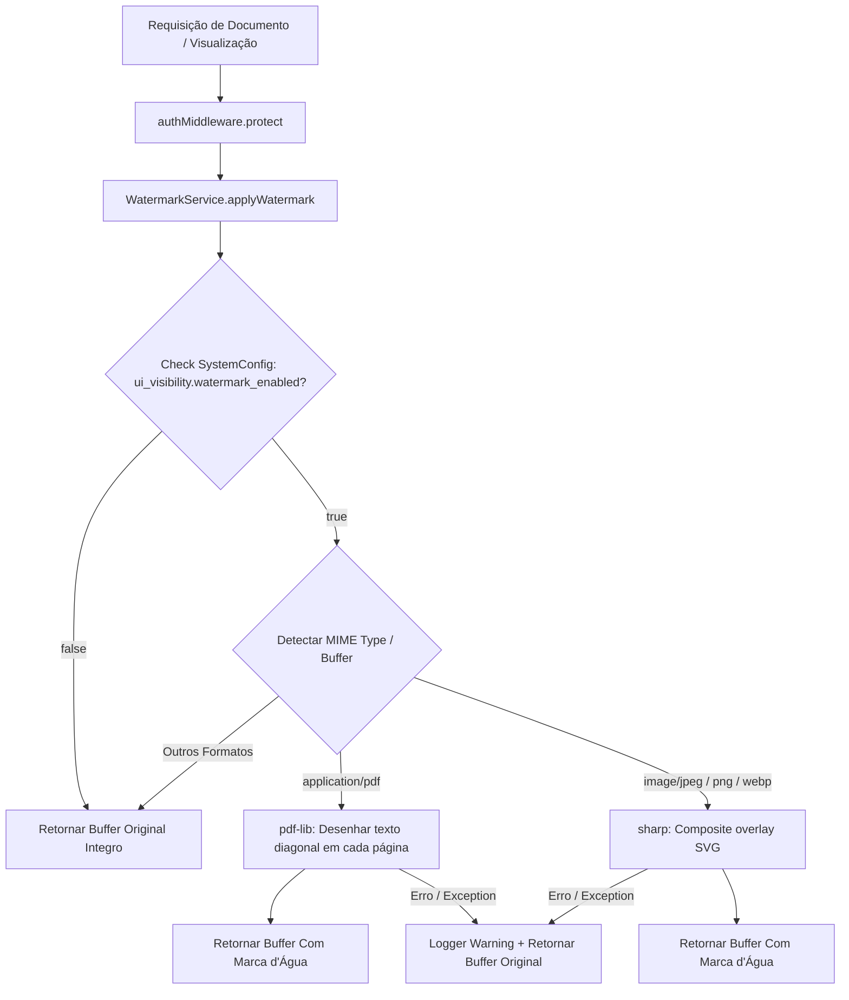

# Desenho Técnico (Design) — Módulo Watermark

Este documento detalha o desenho de arquitetura, contratos de serviço, mecanismos de renderização e fluxos de dados do módulo `modulo-watermark`.

---

## 1. Arquitetura do Módulo

O módulo foi projetado segundo os princípios do SOLID (Single Responsibility Principle & Open/Closed Principle), abstraindo totalmente o motor de marca d'água em um serviço centralizado.

```
src/modules/watermark/
├── index.js                         # Exportador principal e entrypoint do módulo
├── services/
│   └── watermarkService.js           # Orquestrador do motor de marca d'água
├── controllers/
│   └── watermarkController.js        # Controller para endpoint de preview/processamento direto
└── routes/
    └── watermarkRoutes.js           # Definição de rotas Express protegidas (/api/watermark/*)
```

---

## 2. Fluxo de Dados e Decisão (Mermaid)



---

## 3. Especificação do Service (`WatermarkService`)

### Assinatura do Método Principal
```javascript
/**
 * Aplica marca d'água dinâmica em um buffer de arquivo PDF ou imagem.
 * 
 * @param {Buffer} fileBuffer - Buffer do arquivo original.
 * @param {Object} user - Dados do usuário autenticado (name, email, cpf).
 * @param {string} mimeType - MIME type do arquivo (ex: 'application/pdf', 'image/jpeg').
 * @returns {Promise<Buffer>} Buffer processado com a marca d'água ou original em fallback.
 */
async applyWatermark(fileBuffer, user, mimeType)
```

### Regras de Renderização por Motor

#### A. PDF (`pdf-lib`)
- **Lib**: `pdf-lib`
- **Fonte**: `StandardFonts.HelveticaBold`
- **Texto**: `${user.name} | ${user.email || user.cpf || ''} | ${formattedTimestamp}`
- **Opacidade**: `0.25`
- **Ângulo de Rotação**: `45 graus` (`degrees(45)`)
- **Tamanho da Fonte**: Calculado proporcionalmente à largura da página (padrão: 18px a 24px).
- **Repetição**: Desenha o carimbo no centro de cada página ou em grade diagonal.

#### B. Imagem (`sharp`)
- **Lib**: `sharp`
- **Estratégia**: Criação em memória de um buffer SVG transparente com texto rotacionado.
- **Composite**: `sharp(fileBuffer).composite([{ input: svgOverlayBuffer, blend: 'over' }]).toBuffer()`
- **Resolução**: Dimensionado automaticamente de acordo com `width` e `height` da imagem original obtidos via `sharp(fileBuffer).metadata()`.

---

## 4. Integração com o Módulo SystemConfig

O `WatermarkService` consome o `SystemConfig` armazenado no MongoDB na coleção `systemconfigs`:

```javascript
import SystemConfig from '../config-sistema/models/SystemConfig.js';

async function isWatermarkEnabled() {
  const config = await SystemConfig.findOne({ key: 'global_config' }).lean();
  return config?.ui_visibility?.watermark_enabled !== false; // Default true
}
```

---

## 5. Estratégia de Resiliência (Fail-Safe)

Para garantir alta disponibilidade e evitar que um erro no motor de marca d'água impeça o usuário de abrir o contrato ou anexo, o código executa sob um bloco `try/catch` global:

```javascript
try {
  if (!await isWatermarkEnabled()) return fileBuffer;
  // Lógica de injeção...
} catch (error) {
  console.warn('[WatermarkService] Falha ao aplicar marca d\'água. Retornando buffer original:', error.message);
  return fileBuffer;
}
```
